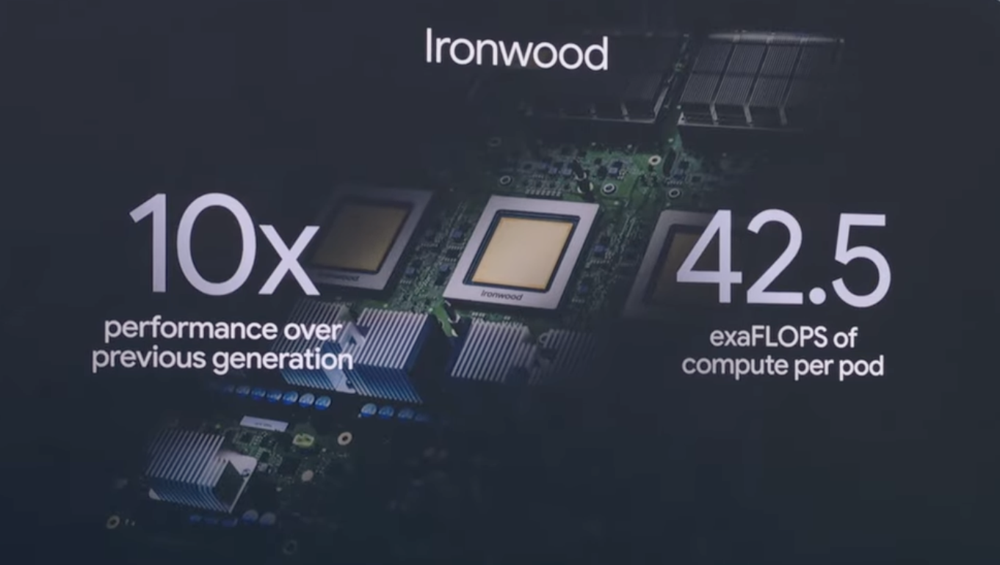
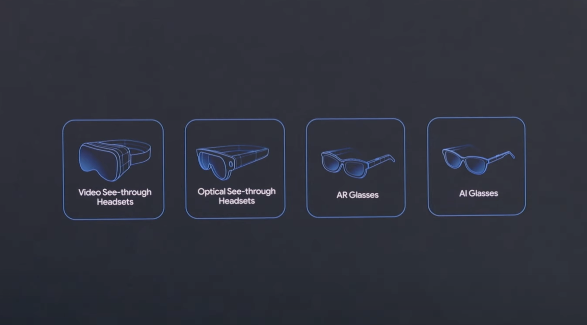
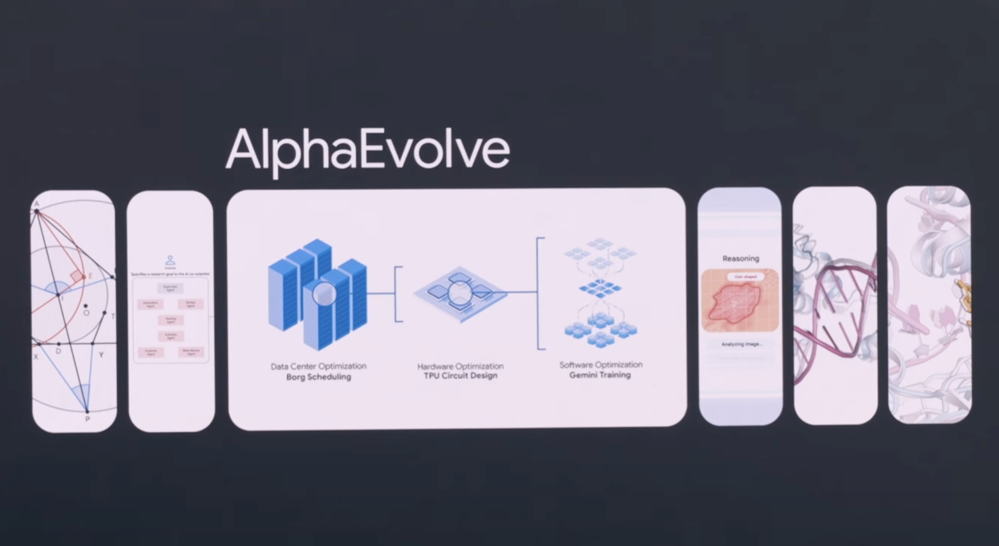

<!-- ---
layout: default
title: "Ironwood"
permalink: /google-io/2025/ironwood/
--- -->

# Ironwood TPU与Gemini 2.5 Pro驱动百万Token多模态AI新纪元

- 搜索截止日期: 2025-05-20

## 摘要

- **Ironwood TPU第七代AI加速器实现推理架构范式转变**，专为大规模推理优化，单芯片峰值达4,614 TFLOPs、192GB HBM3E、7.2TBps带宽，9,216芯片组成的Pod可提供42.5 ExaFLOPS算力，能效较前代提升2倍，显著降低大模型推理成本并支撑Gemini 2.5 Pro等超大模型的实时服务（如Ironwood TPU Pod单集群42.5 ExaFLOPS，2024年下半年开放云端商用）。
- **Gemini 2.5 Pro/Flash原生多模态与超长上下文窗口突破**，支持文本、图像、音频、视频等多模态输入，单次上下文窗口扩展至100万Token，远超主流竞品（如Claude 3.7 Sonnet 200K、OpenAI o3-mini 200K），大幅提升代码理解、长文档推理与多模态交互能力（示例：2.5 Pro在GPQA Diamond科学推理84.0%、AIME 2024数学92.0%、Humanity’s Last Exam 18.8%等基准测试领先）。
- **AI硬件-软件协同与云原生超算基础设施（AI Hypercomputer）**，通过Pathways分布式调度、Cluster Director for GKE/Slurm等集群管理，支持TPU资源弹性调度与高可用，开放Vertex AI等主流框架，助力开发者与企业低门槛部署大模型推理与训练（如Google一年内AI产品月处理Token量从9.7万亿增至480万亿，开发者超700万）。
- **Agentic AI系统与开放协议推动AI从被动检索向主动任务执行演进**，Project Mariner结合Gemini多模态推理与Teach-and-Repeat范式，支持浏览器内多任务自动化与用户可控的多步操作，开放Agent-to-Agent协议与MCP标准，促进跨厂商、跨平台AI代理互操作（如Mariner在WebVoyager基准83.5%成功率，已与Automation Anywhere、UiPath等集成）。
- **AI硬件生态向多终端、多场景延展，Gemini Nano/Pro深度集成Android XR、可穿戴与眼镜设备**，实现端云协同的实时多模态感知、环境理解与主动辅助，推动AI助手从手机扩展至XR头显、智能眼镜、手表、车载等全场景（如三星Project Muhan XR头显、Gentle Monster/Warby Parker智能眼镜，支持实时翻译、导航、视觉辅助等）。

## Gemini 2.5 Pro与Flash：基础AI模型的突破

### 模型架构、推理与性能指标

Gemini 2.5 Pro及其兄弟产品Gemini 2.5 Flash的发布，标志着基础AI模型演进的关键时刻。这些模型不仅是渐进式升级，更代表了对大语言模型（LLM）在推理、可扩展性和实际应用能力上的全新思考。  
Gemini 2.5 Pro将推理能力作为原生特性进行架构设计，而非事后补充。这一转变体现在其能够跨数学、科学、软件工程等领域解决复杂多步问题。该模型支持高达100万token的上下文窗口——是Claude 3.7 Sonnet和OpenAI o3-mini等主流竞品的五倍，远超DeepSeek R1的128K上下文[[1]](https://www.helicone.ai/blog/gemini-2.5-full-developer-guide)[[2]](https://www.datacamp.com/blog/gemini-2-5-pro)。这使Gemini 2.5 Pro能够一次性处理完整代码库或长文档，无需检索增强生成（RAG）流程，为企业和科研应用解锁新可能。
内部基准测试和独立评估均凸显了Gemini 2.5 Pro的领先地位。在重推理任务上，其在Humanity’s Last Exam中得分18.8%，领先于o3-mini（14%）和Claude 3.7 Sonnet（8.9%）。在科学与数学领域，GPQA Diamond得分84.0%，AIME 2024得分92.0%，树立了事实与逻辑推理的新标杆[[1]](https://www.helicone.ai/blog/gemini-2.5-full-developer-guide)[[2]](https://www.datacamp.com/blog/gemini-2-5-pro)。编程基准测试显示：Gemini 2.5 Pro在代码理解和大型项目架构上表现突出，尽管Claude 3.7 Sonnet在SWE-bench Verified上略占优势（70.3%对63.8%），o3-mini在LiveCodeBench v5上领先（74.1%对70.4%）。但Gemini在理解和推理大规模代码库方面的独特能力，尤其适用于复杂多文件项目。
Gemini 2.5 Pro引入的Deep Think模式进一步推动了AI推理的边界。通过在回答前考虑多种假设，Deep Think在USAMO 2025测试中取得49.4%的成绩，远超标准模型的34.5%，预示着未来更高级代理推理的潜力[[3]](https://beebom.com/google-unveils-gemini-2-5-pro-deep-think-and-improved-gemini-2-5-flash/)。

### 多模态与多语言能力

Gemini 2.5 Pro与Flash自底向上设计为多模态模型，原生支持文本、图像、音频和视频输入。这种多模态不仅是技术特性，更是推动新型应用的战略支撑。例如，Gemini 2.5 Pro可分析游戏视频，批评玩法及底层代码，并提出针对性改进建议，全部在单一工作流中完成[[2]](https://www.datacamp.com/blog/gemini-2-5-pro)。这在教育、创意产业和科学研究等信息多元领域尤为有价值。
多语言支持也是Gemini模型的强项。Flash版本原生支持24种以上语言的多说话人音频输出，并可在同一对话中流畅切换语言[[3]](https://beebom.com/google-unveils-gemini-2-5-pro-deep-think-and-improved-gemini-2-5-flash/)。这为实时翻译、无障碍沟通和全球协作带来新可能。富有表现力的音频输出（如低语等细微语气）进一步提升了人机交互的自然度。
这些多模态与多语言能力已在现实中得到验证。Google I/O现场演示了从Google Meet实时语音翻译到可将草图转为完整3D Web应用的交互式编程助手，涵盖语音与视觉反馈。这些案例展示了模型在跨文化、跨语言、跨行业普及AI能力的潜力。

### 效率、可扩展性与成本优化

部署大型AI模型的最大挑战之一是性能、效率与成本的平衡。Gemini 2.5 Pro与Flash通过架构创新和产品设计正面应对这一难题。
Gemini 2.5 Flash作为轻量、低成本版本，以极低的计算成本实现了出色性能。在LM Arena排行榜上，其排名仅次于Gemini 2.5 Pro（ELO 1424对1446），但token使用效率提升22%，显著降低延迟[[3]](https://beebom.com/google-unveils-gemini-2-5-pro-deep-think-and-improved-gemini-2-5-flash/)。引入的“思考预算”机制允许开发者细致调控成本、延迟与输出质量之间的权衡，实现资源分配的精细化管理，对大规模部署尤为重要。
模型定价对比如下：
| Model                   | 输入成本（$/百万tokens） | 输出成本（$/百万tokens） |
|-------------------------|-------------------------|-------------------------|
| OpenAI GPT-4.5          | $75.00                  | $150.00                 |
| Claude 3.7 Sonnet       | $3.00                   | $15.00                  |
| Gemini 2.5 Pro (Std)    | $1.25                   | $10.00                  |
| Gemini 2.5 Pro (Ext)    | $2.50                   | $15.00                  |
| OpenAI o3-mini          | $1.10                   | $4.00                   |
| Gemini 2.0 Flash        | $0.10                   | $0.00                   |
该表显示，Gemini 2.5 Pro在能力与成本之间实现了极佳平衡，尤其适合需要大上下文窗口或多模态处理的应用[[1]](https://www.helicone.ai/blog/gemini-2.5-full-developer-guide)。对于成本敏感场景，Gemini 2.0 Flash则提供了更实惠的选择，且不牺牲核心功能。
可扩展性方面，Google底层基础设施（如第七代TPU Ironwood）提供了前所未有的算力，每个pod达42.5 exaflops，性能是前代的10倍。这支持了模型的快速迭代、高吞吐推理，并能为Search、Gemini App、Google Cloud等产品的数亿用户提供服务。
这些效率提升的现实影响体现在采用数据上：Google每月处理480万亿tokens，同比增长50倍，超过700万开发者已通过Gemini API构建应用，体现了平台的可扩展性与易用性。

## Ironwood TPU与可扩展AI基础设施

AI的快速发展不仅是模型变得更智能的故事，更是支撑这些突破的“隐形引擎”的故事。Google最新AI进展的核心，是新一代基础设施：Ironwood TPU。本节将探讨Ironwood的架构、生态影响及其对可扩展、普惠AI未来的深远意义。

### 第七代TPU Ironwood架构

Ironwood代表了Google在AI硬件设计上的重大转变。与以往兼顾训练与推理的TPU不同，Ironwood专为大规模推理而生——反映出AI实用性的瓶颈正从训练速度转向推理部署的效率[[4]](https://cloud.google.com/resources/ironwood-tpu-interest)[[5]](https://ssojet.com/blog/google-unveils-ironwood-7th-gen-tpu-for-enhanced-ai-inference)[[6]](https://www.cosmico.org/google-launches-ironwood-tpu-24x-faster-ai-chip/)[[7]](https://futurumgroup.com/insights/google-debuts-ironwood-tpu-to-drive-inference-focused-ai-architecture-at-scale/?utm_source=rss&utm_medium=rss&utm_campaign=google-debuts-ironwood-tpu-to-drive-inference-focused-ai-architecture-at-scale)。这不仅是技术细节，更预示着行业正步入Google所称的“推理时代”，AI系统需成为始终在线、响应迅速、具备上下文感知的智能体。
技术上，Ironwood在规模与效率上堪称奇迹。每颗芯片峰值达4,614 TFLOPs，配备192GB高带宽内存（HBM），是前代Trillium的六倍[[5]](https://ssojet.com/blog/google-unveils-ironwood-7th-gen-tpu-for-enhanced-ai-inference)[[8]](https://ssojet.com/blog/google-unveils-ironwood-7th-gen-tpu-for-enhanced-ai-inference/)[[7]](https://futurumgroup.com/insights/google-debuts-ironwood-tpu-to-drive-inference-focused-ai-architecture-at-scale/?utm_source=rss&utm_medium=rss&utm_campaign=google-debuts-ironwood-tpu-to-drive-inference-focused-ai-architecture-at-scale)。内存带宽每芯片7.2TBps，芯片间互联（ICI）达1.2Tbps双向，极大降低延迟、提升张量运算吞吐[[5]](https://ssojet.com/blog/google-unveils-ironwood-7th-gen-tpu-for-enhanced-ai-inference)[[8]](https://ssojet.com/blog/google-unveils-ironwood-7th-gen-tpu-for-enhanced-ai-inference/)。完整9,216芯片pod可提供42.5 exaflops算力，超越El Capitan超级计算机24倍[[5]](https://ssojet.com/blog/google-unveils-ironwood-7th-gen-tpu-for-enhanced-ai-inference)[[8]](https://ssojet.com/blog/google-unveils-ironwood-7th-gen-tpu-for-enhanced-ai-inference/)[[6]](https://www.cosmico.org/google-launches-ironwood-tpu-24x-faster-ai-chip/)[[7]](https://futurumgroup.com/insights/google-debuts-ironwood-tpu-to-drive-inference-focused-ai-architecture-at-scale/?utm_source=rss&utm_medium=rss&utm_campaign=google-debuts-ironwood-tpu-to-drive-inference-focused-ai-architecture-at-scale)。
Ironwood不仅追求算力，还集成了SparseCore等高级特性，加速排名、推荐等数据密集型任务，并支持FP8计算，提升AI应用的效率与灵活性[[8]](https://ssojet.com/blog/google-unveils-ironwood-7th-gen-tpu-for-enhanced-ai-inference/)[[6]](https://www.cosmico.org/google-launches-ironwood-tpu-24x-faster-ai-chip/)。芯片设计采用多芯片模块与HBM3E内存，进一步增强对LLM、MoE及高级推理任务的适应性[[5]](https://ssojet.com/blog/google-unveils-ironwood-7th-gen-tpu-for-enhanced-ai-inference)[[8]](https://ssojet.com/blog/google-unveils-ironwood-7th-gen-tpu-for-enhanced-ai-inference/)[[7]](https://futurumgroup.com/insights/google-debuts-ironwood-tpu-to-drive-inference-focused-ai-architecture-at-scale/?utm_source=rss&utm_medium=rss&utm_campaign=google-debuts-ironwood-tpu-to-drive-inference-focused-ai-architecture-at-scale)。
更重要的是，Ironwood能效是前代Trillium的两倍，较2018年TPU v2提升近30倍[[8]](https://ssojet.com/blog/google-unveils-ironwood-7th-gen-tpu-for-enhanced-ai-inference/)[[7]](https://futurumgroup.com/insights/google-debuts-ironwood-tpu-to-drive-inference-focused-ai-architecture-at-scale/?utm_source=rss&utm_medium=rss&utm_campaign=google-debuts-ironwood-tpu-to-drive-inference-focused-ai-architecture-at-scale)。这一飞跃不仅是技术里程碑，更是AI可持续扩展的前提，尤其在模型规模与复杂度不断增长的背景下。

### 云集成与开发者生态

Ironwood的影响力因其深度集成于Google AI Hypercomputer架构而倍增——这是为前所未有规模的训练与推理设计的模块化、云原生超级计算系统[[4]](https://cloud.google.com/resources/ironwood-tpu-interest)[[5]](https://ssojet.com/blog/google-unveils-ironwood-7th-gen-tpu-for-enhanced-ai-inference)[[7]](https://futurumgroup.com/insights/google-debuts-ironwood-tpu-to-drive-inference-focused-ai-architecture-at-scale/?utm_source=rss&utm_medium=rss&utm_campaign=google-debuts-ironwood-tpu-to-drive-inference-focused-ai-architecture-at-scale)。该系统利用Pathways框架，实现动态扩展、分布式服务与无缝AI工作负载编排[[5]](https://ssojet.com/blog/google-unveils-ironwood-7th-gen-tpu-for-enhanced-ai-inference)[[8]](https://ssojet.com/blog/google-unveils-ironwood-7th-gen-tpu-for-enhanced-ai-inference/)。如GKE与Slurm的Cluster Director等功能，保障集群管理、高可用性与快速资源调度，让开发者和企业能轻松获取海量算力[[8]](https://ssojet.com/blog/google-unveils-ironwood-7th-gen-tpu-for-enhanced-ai-inference/)。
开发体验因对Vertex AI、Pathways等主流框架的支持而进一步提升，使团队能在不被专有技术锁定的前提下，便捷构建、部署和迭代先进AI模型[[4]](https://cloud.google.com/resources/ironwood-tpu-interest)[[5]](https://ssojet.com/blog/google-unveils-ironwood-7th-gen-tpu-for-enhanced-ai-inference)。这种开放、灵活的策略对于培育创新生态至关重要，不仅利于Google，也惠及更广泛的AI社区。
从战略角度看，Ironwood让Google在竞争激烈的AI芯片市场占据有利地位。尽管NVIDIA凭借Blackwell Ultra及即将推出的Rubin、Feynman芯片持续领先，Amazon和Microsoft也在推进自研芯片，但Ironwood赋予Google在成本、性能和工作负载匹配上的更大自主权，尤其适合推理密集、实时应用[[6]](https://www.cosmico.org/google-launches-ironwood-tpu-24x-faster-ai-chip/)[[7]](https://futurumgroup.com/insights/google-debuts-ironwood-tpu-to-drive-inference-focused-ai-architecture-at-scale/?utm_source=rss&utm_medium=rss&utm_campaign=google-debuts-ironwood-tpu-to-drive-inference-focused-ai-architecture-at-scale)。这不仅关乎技术领先，更关乎塑造AI经济学与普及性的主动权。
更广泛的背景是智能的民主化。通过Google Cloud开放最先进的推理基础设施，Ironwood让初创公司、研究者和企业都能构建和部署曾经只有科技巨头才能实现的模型。这一转变已在AI产品和功能的爆发式增长中体现——自上届I/O以来，Google平台每月token处理量增长50倍，重大AI产品发布超过20项。
然而，值得深思的是：规模是否是唯一进步路径？它是否会导致权力集中、提高小型玩家的准入门槛？如何确保Ironwood的效率红利惠及更广泛社会，而非仅为既有优势者带来更快、更便宜的AI？这些都是行业在基础设施前沿不断演进中必须面对的问题。

## Agentic AI系统：Project Mariner与开放协议

Agentic AI系统的出现，标志着人工智能与数字世界交互方式的深刻转变——从被动信息检索转向主动、自主的任务执行。在Google I/O上，Project Mariner及推动开放代理协议的举措，展现了AI代理跨Web和数字生态主动为用户执行任务的技术前景与复杂挑战。

### Agent Mode与多步任务自动化

Project Mariner是agentic AI前沿的代表，体现了Google基于Gemini 2.0模型的浏览器自动化新愿景。与传统助手仅回答查询不同，Mariner可自主导航、理解并交互复杂Web环境，执行以往需人工介入的多步任务[[9]](https://www.educative.io/answers/what-is-googles-project-mariner)[[10]](https://aijourney.so/tool/project-mariner)。
Mariner的技术基础源于Gemini的多模态能力，使代理能跨文本、图像、代码、UI元素等多元数据类型进行推理，理解网页内容、结构及可操作组件[[11]](https://blog.adyog.com/2025/01/04/how-googles-project-mariner-is-revolutionizing-web-interaction-with-ai/)。例如，Mariner能识别按钮、表单、链接，并生成、执行相应操作，实现订票、填表、从非结构化网页提取结构化信息等目标[[12]](https://www.zdnet.com/article/what-is-googles-project-mariner-this-ai-agent-can-navigate-the-web-for-you/)[[13]](https://www.c-sharpcorner.com/news/google-unveils-project-mariner-ai-agents-for-web-automation)。
I/O上突出的一项创新是Mariner对多任务和“教与复现”范式的支持。代理可同时管理多达10项任务，并通过用户演示学习通用操作计划，实现未来类似流程的自动化[[14]](https://www.theverge.com/news/670848/google-agent-mode-gemini-app-project-mariner-i-o-2025)。这不仅提升效率，也预示着代理能在有限监督下自适应、泛化，是大规模现实部署的关键一步。
不过，Mariner当前实现有意受限。它仅在活跃Chrome标签页运行，用户需实时观察其操作，并对如购买等敏感操作明确确认[[15]](https://theoutpost.ai/news-story/google-unveils-project-mariner-an-ai-agent-that-can-navigate-the-web-for-you-9437/)[[13]](https://www.c-sharpcorner.com/news/google-unveils-project-mariner-ai-agents-for-web-automation)。这种设计在自主性与用户控制间做出权衡，优先保障透明度与安全。系统的可视化反馈与逐步推理进一步增强用户信任，使用户能理解并在必要时介入代理决策[[16]](https://deepmind.google/technologies/project-mariner/)[[12]](https://www.zdnet.com/article/what-is-googles-project-mariner-this-ai-agent-can-navigate-the-web-for-you/)。
基准测试显示Mariner技术成熟。在WebVoyager基准上，Mariner在真实Web任务中成功率达83.5%，为迄今最高[[16]](https://deepmind.google/technologies/project-mariner/)[[17]](https://beebom.com/project-mariner-google-ai-agent-perform-tasks-chrome/)。但现实表现仍在完善，测试者反馈存在延迟及偶尔需澄清，凸显Web自动化的稳健性与泛化性挑战[[18]](https://degennfts.medium.com/is-project-mariner-a-game-changer-for-ai-agents-092f6a1d998b)[[13]](https://www.c-sharpcorner.com/news/google-unveils-project-mariner-ai-agents-for-web-automation)。
Gemini App中的“Agent Mode”将这些能力扩展到浏览器之外，将Mariner自动化与Google更广泛生态整合。用户可委托复杂多步目标（如找房、活动策划），代理自动协调Web交互、工具集成与后续操作，同时保持用户知情与掌控[[19]](https://9to5google.com/2025/05/20/project-mariner-gemini-search/)。这预示着数字助手正从被动工具转向主动伙伴。

### 开放代理生态与互操作性

Project Mariner虽代表agentic AI的技术前沿，其更广泛影响取决于互操作性与开放代理生态的培育。Google宣布开放代理间协议，并兼容Anthropic提出的Model Context Protocol（MCP），反映出一个战略共识：单一代理或平台无法满足所有用户需求或数字环境[[19]](https://9to5google.com/2025/05/20/project-mariner-gemini-search/)。
开放协议是实现不同厂商、领域、模态代理无缝通信、协作、任务委托的基础。例如，在找房场景中，Gemini的agent mode结合Mariner进行Web自动化，利用MCP访问第三方服务，并通过开放协议与外部代理协同，体现了可组合性与跨代理编排的价值[[19]](https://9to5google.com/2025/05/20/project-mariner-gemini-search/)。这不仅提升用户体验，也促进更具竞争力和创新力的生态，降低厂商锁定和能力孤岛的风险。
开放标准还回应了信任、安全与用户主权等更深层问题。通过使代理交互透明、可审计，并允许用户定义权限与边界，开放协议有助于缓解自主操作带来的风险，如意外购买、隐私泄露或恶意利用[[11]](https://blog.adyog.com/2025/01/04/how-googles-project-mariner-is-revolutionizing-web-interaction-with-ai/)。此外，互操作性鼓励专用代理（如科研助手、电商机器人）发展，并可组合成更强大的上下文感知工作流。
但实现真正开放的agentic生态仍面临诸多挑战。技术难题包括通信协议标准化、强认证与授权、跨异构代理与服务的上下文管理。社会与伦理问题同样突出：Web任务自动化引发就业替代、用户控制权转移、代理可能无意传播偏见或虚假信息等担忧[[11]](https://blog.adyog.com/2025/01/04/how-googles-project-mariner-is-revolutionizing-web-interaction-with-ai/)。
Google选择先向受信测试者开放Mariner及其协议，并优先安全评估，体现了对这些复杂性的认知。公司强调可解释性、用户监督与渐进部署是明智之举，但agentic AI的最终成功有赖于产业、学界与社会的持续协作。

## 通用AI助手：Project Astra与Gemini App

### 实时多模态理解与交互

打造真正通用的AI助手一直是人工智能的核心追求，Google I/O上的最新进展标志着这一目标的重大飞跃。Project Astra与Gemini App共同展现了AI如何从被动工具进化为主动、具备上下文感知的协作伙伴，能够实时理解并行动于现实世界。
这一变革的核心是Gemini的原生多模态能力。与以往专注单一输入类型的模型不同，Gemini 2.5 Pro及其衍生版本可同时处理并推理文本、图像、音频、视频，实现更丰富自然的交互范式。这不仅是技术突破，更彻底重塑了AI“理解”世界的方式。例如，现已在Android和iOS上线的Gemini Live，结合了Project Astra的摄像头与屏幕共享功能，用户可就所见之物与AI对话，无论是识别环境中的物体、解读手写笔记，还是为复杂任务提供分步指导。
其影响深远。Project Astra演示的实时视频理解，使助手能跟随用户视线、解读周围环境，并跨多模态保持上下文。这不仅是便利，更是AI系统参与用户真实生活体验的基础性转变。Astra协助用户修理自行车——查阅手册、搜索零件、甚至拨打电话——展现了感知、推理与行动的无缝整合。
此外，Gemini App的“agent mode”展示了下一步进化：能自主编排Web及互联服务多步任务的agentic AI。结合Gemini推理与Project Mariner的多任务和教与复现能力，助手可自动搜索公寓、筛选房源、安排看房并持续监控新机会，几乎无需用户干预。这一agentic能力由强大的基础设施和协议（如开放代理协议及对Anthropic MCP的兼容）支撑，确保在更广泛AI生态中的互操作性与可扩展性[[20]](https://www.androidcentral.com/apps-software/ai/google-gemini-vision-world-model-explained)。
这些进步不仅限于技术本身，更注重广泛复用性。Gemini API向开发者开放多模态与agentic能力，催生能“看”“听”“行动于世界”的新一代应用，模糊了数字与现实辅助的界限[[21]](https://ai.google.dev/gemini-api/docs/models)。Gemini因此不仅是产品，更是通用AI助手的平台。

### 无障碍与日常任务自动化

通用AI助手的最大价值在于切实改善日常生活，尤其是为以往信息与交互受限的人群带来便利。Project Astra与Gemini App已在无障碍与任务自动化领域展现出AI的倍增效应。
最引人注目的应用之一是实时语音翻译与对话无障碍。通过将Starline底层技术集成至Google Meet，乃至可穿戴设备如Android XR眼镜，Gemini实现了跨语言、跨模态的自然流畅对话。XR眼镜上印地语与波斯语实时翻译的现场演示，展现了AI弥合沟通鸿沟、促进全球协作与社交包容的潜力。
在视觉或认知障碍辅助方面，Gemini的多模态理解让用户更独立地导航世界。与Aira合作，为盲人和低视力群体提供AI视觉解读，证明了技术的社会影响力。Gemini通过摄像头“看见”并提供环境信息，成为随时在侧的向导，能读标识、识别物体、协助导航与日程安排。
日常任务自动化是Gemini agentic能力的另一前沿。助手现可自动管理复杂工作流——如预订旅行、组织日程、购物结账——通过自主Web服务交互、表单填写和基于用户偏好的决策实现。引入“个人上下文”后，Gemini可在用户授权下，整合Gmail、Drive、Calendar等信息，进一步个性化和简化体验。这不仅节省时间，也减轻认知负担，让用户专注于更有价值的活动。
这些功能的推广始终强调隐私、透明与用户控制。用户可自主选择共享信息、审查和管理数据，随时断开服务。这是建立信任、确保通用AI助手赋能而非侵扰的关键。
总之，Project Astra与Gemini App在实时多模态理解、agentic任务自动化与无障碍功能上的融合，标志着AI进化的关键节点。这些系统不仅更智能，更贴近人类生活复杂性，更能适应多样需求，将研究突破转化为日常现实。随着技术成熟与普及，真正有用、主动、包容的通用AI助手正从愿景走向必然。

## 生成式媒体：Imagen 4、VO3与Lyria 2

### 图像、视频与音频生成创新

Google I/O上生成式媒体模型的快速演进，预示着AI赋能创意、沟通与内容生产方式的深刻变革。Imagen 4、VO3与Lyria 2的发布，不仅是渐进提升，更是对多模态、表现力与协作创作可能性的全新定义。
Imagen 4作为最新图像生成模型，在视觉逼真度与功能实用性上实现飞跃。其对色彩、细节、文本排版的精细渲染，解决了生成艺术长期存在的难题，尤其适用于海报设计、视觉叙事等场景。模型在字体排版上的创新——能将文本创意融入图像，兼顾拼写准确与艺术表现——较前代有重大突破。这不仅是技术进步，更为设计师、市场人员及普通用户带来专业级视觉创作能力。
VO3作为新一代视频生成模型，更进一步集成了原生音频生成。用户首次可通过提示生成不仅具备照片级真实感的视频序列，还能同步生成音效、环境音乃至角色对白。这对内容创作者意义重大：可直接从文本或视觉提示原型化完整场景，涵盖动作、情感与声音。VO3对物理、材质属性和场景一致性的理解，使其能跨帧保持真实感，满足娱乐与教育内容的高要求。
Lyria 2则将高保真音乐与专业级音频生成推向前台。通过与音乐人、创作者合作，Google将Lyria 2打造成能生成表现力独奏、合唱编排及特定风格作品的工具。模型对音乐细腻与情感的捕捉，不仅是技术成就，更让专业与业余创作者都能以极低门槛探索新创意方向。
这些模型共同体现了多模态AI的融合——文本、图像、音频、视频在创作流程中不再割裂，而是深度交织。这一融合得益于模型架构、训练数据多样性与可扩展基础设施的进步，实现了前所未有的实时生成与迭代质量。

### 创意工具与行业协作

除Imagine 4、VO3、Lyria 2的原生能力外，Google在生成式媒体领域的独特之处在于对工具建设与生态发展的重视。AI电影制作工具Flow的推出即为典范。Flow允许创作者上传或生成视觉素材，精确控制镜头组装，并在镜头间保持角色与场景一致性，界面直观、支持迭代。该工具不仅面向AI研究者或工程师，更为电影人、动画师、讲故事者设计，让AI成为创意伙伴而非黑箱生成器。
行业协作是这一愿景的核心。Google与电影人、音乐人、艺术家的合作，直接影响了模型能力与用户体验。例如，与导演Eliza McNitz合作的短片《Sestra》，展示了VO3如何将真人表演与AI生成视频融合，开创了传统方法难以实现的新电影表达。同样，Music AI Sandbox在专业音乐人参与下开发，确保Lyria 2满足作曲家与制作人的细致需求。
这些创新的关键且常被忽视的一点，是对负责任AI与内容真实性的关注。SynthID隐形水印技术扩展至图像、音频、文本、视频，是对深度伪造与合成媒体泛滥挑战的积极回应。通过大规模嵌入与检测水印，Google既保障了创意自由，也维护了数字内容的信任与溯源。
更广泛地看，这些进展反映了AI在创意领域角色认知的转变。新一代生成式媒体工具不再将AI视为人类创造力的替代，而是放大器与协作者。Flow的迭代交互流程、Lyria 2的表现力、VO3的多模态合成，都预示着人机创意深度融合的未来。
但根本性问题仍待解答。随着生成模型变得更强大、更易用，原创与合成内容的界限如何界定？新的作者权、所有权与协作模式将如何出现？如何确保这些工具的红利公平分配，避免创意权力集中？
这些不仅是技术或产品问题，更是社会问题。Imagine 4、VO3、Lyria 2的成功，最终取决于塑造其使用的框架、社区与价值观。Google当前以技术创新、工具建设与行业合作为特色的路径，提供了有前景的模板，但在生成式媒体日益成为创作核心的未来，这一模式仍需持续反思、调整与对话。

## 负责任AI内容溯源：SynthID与透明性

### 生成媒体的隐形水印

随着生成式AI模型的快速进步，合成与真实内容的界限日益模糊。这带来了巨大创意潜力，也引发了信任、溯源与AI生成内容负责任部署的关键问题。Google的SynthID技术应运而生，通过在AI生成的图像、音频、文本、视频中嵌入隐形水印，实现内容溯源而不影响用户体验或创意灵活性。
SynthID通过微妙改变生成媒体的底层数据，使其对人类感官不可察觉，但可被专用工具可靠检测。这与可见水印不同，后者易影响美观或被裁剪去除。SynthID的隐形水印即使在裁剪、压缩、格式转换等常见变换后仍能保留，为频繁混剪、再分发的数字生态提供了坚韧的内容溯源方案。
SynthID的部署规模已达百亿级，反映出将此类技术集成至主流生成式AI工作流的紧迫性与可行性。Google正扩展合作伙伴关系，推动更多组织能嵌入与检测SynthID水印，迈向AI内容溯源的行业标准。
最新版本的SynthID具备跨模态能力。新检测器不仅能识别完整媒体中的水印，还能检测片段（如音频片段、裁剪图像、短视频段落）中的水印。这种细粒度检测对追踪内容在编辑、采样或被整合进更大作品时的溯源至关重要，支持更透明、可问责的创意生态。

### 透明性、安全与内容溯源

SynthID的更广泛背景是生成式AI时代对透明性与安全的日益迫切需求。随着合成媒体与真实内容难以区分，虚假信息、深度伪造与未授权使用的风险加剧。SynthID通过为内容溯源提供技术基础，使平台、创作者和用户能验证媒体来源，区分真实与AI生成作品[[22]](https://deepmind.com/discover/blog/taking-a-responsible-path-to-agi/)。
透明性不仅是技术挑战，更是社会挑战。Google通过在基础设施层嵌入透明性，使下游应用、监管者和终端用户无需依赖自愿披露或手动标记即可获取溯源信息。这在生成模型更易获取、输出更广泛渗透新闻、娱乐、教育、科研等领域时尤为重要。
安全同样是核心考量。SynthID让检测AI生成内容更容易，有助于防止恶意分子将合成媒体冒充真实内容用于欺诈、操纵等有害目的。该技术设计上能抵抗水印移除或混淆的攻击，提高了对抗性滥用的门槛。
但SynthID的推广也带来数字内容治理的更深层问题。谁掌控水印与检测的密钥？如何确保系统在跨平台、跨司法辖区下开放互通？Google通过扩展合作伙伴、向早期测试者开放检测工具，正努力构建协作生态，但最终成败有赖于行业广泛采纳、监管协同与持续公众参与[[22]](https://deepmind.com/discover/blog/taking-a-responsible-path-to-agi/)。

## Gemini与Search中的个性化与上下文智能

AI模型的快速演进不仅体现在智能或多模态能力上，更在于系统如何实现个性化、上下文感知与主动帮助。在Google I/O上，个性化与上下文智能的融合成为Gemini AI生态与未来Google Search的决定性趋势。本节探讨这些进步如何重塑用户体验、其技术基础及对可扩展、可复用AI系统的深远影响。

### 个人上下文与主动辅助

Gemini及其在Google生态中的整合，源于一个深刻转变：从被动AI转向真正主动、具备上下文感知的助手。这不仅是功能叠加，更是对AI如何成为用户延伸——预判需求、适应偏好、以细致的个人上下文行动——的根本性重构。
这一变革的核心是“个人上下文”理念。Gemini模型在用户授权下，可整合Gmail、Calendar、Drive、Search历史等多源信号，为个体量身定制响应与行动。例如，Gemini在回复邮件时可参考过往对话、预订信息，甚至用户常用语气与措辞，生成更具个性化的回复。这不仅是技术壮举，更标志着用户与AI关系从工具转向协作伙伴。
影响深远。借助个人上下文，Gemini可超越通用辅助，提供主动支持。想象AI能察觉你日程中的考试，无需提示即自动整理个性化学习资料、测验、甚至定制讲解视频，贴合你的兴趣与学习风格。这种预判与适应，只有深度整合用户数据才能实现——既带来生产力提升，也对隐私、透明与用户控制提出新挑战。
Google强调，这种上下文智能始终由用户掌控：用户可选择连接哪些数据源，随时审查、管理所用信息，并可随时断开。这是关键设计原则，个性化的力量必须以强隐私保护与用户主权为前提。
技术上，实现此类上下文感知AI需多方面突破：
- 长上下文窗口模型（如Gemini 1.5 Pro与2.5 Pro），能处理并推理海量异构数据[[21]](https://ai.google.dev/gemini-api/docs/models)。
- 安全、透明的数据管道，实现实时上下文聚合且不损隐私。
- 自适应提示工程与检索增强生成，使模型能为每项任务提取最相关信息。
值得注意的是，这些能力不仅在旗舰产品中实现，更以API和SDK形式向开发者开放，为各领域打造深度个性化、上下文感知体验的新应用铺平道路。

### Google Search中的AI Mode与深度研究

Google Search向智能、agentic、个性化平台的转型，是上述趋势最直观的体现。AI Mode与Deep Research功能的引入，标志着搜索从以信息检索为主的传统范式，转向以智能、综合与行动为核心的未来。
AI Mode由Gemini 2.5驱动，支持用户提出复杂、多层次、高度个性化的查询。系统采用“查询扩展”技术，将用户问题拆解为子主题，跨Web与Google实时数据图并行检索，综合生成既准确又贴合用户上下文的响应。这彻底重塑了搜索，模糊了搜索、推荐与个人助手的界限。
个人上下文在体验中无缝融合。例如，规划旅行时，AI Mode可结合近期餐厅预订、订阅邮件、Gmail中的航班与酒店确认信息，推荐符合用户偏好与日程的活动。这不仅是便利，更展示了上下文智能如何提升信息服务的相关性与实用性。
Deep Research更进一步，使用户能用单一提示进行专家级调研。系统可发起数十甚至数百次搜索，跨异源推理，生成带完整引用的报告，普及了原本只有专家才能享有的综合分析能力。支持上传个人文件、与Drive和Gmail集成，并能将研究成果转为动态网页、信息图甚至通过Canvas生成播客，展现了AI作为知识伙伴的潜力。
这些进步也带来挑战。对个人数据的依赖与服务深度整合，涉及数据治理、可解释性与过度个性化风险。如何在有用与侵扰间取得平衡，维护用户信任，需依赖透明、控制与强隐私保护。
更广泛地看，AI Mode与Deep Research背后的技术创新——如可扩展多模态模型、实时数据融合、agentic编排——高度可复用，为其他平台和行业构建能推理、行动、适应的大规模智能系统树立了模板。

## 跨设备多模态AI：Android XR与可穿戴设备

AI的快速演进不再局限于云端模型或桌面应用，正通过可穿戴、头显、智能眼镜等设备进入现实世界。在Google I/O上，Gemini多模态智能融入Android XR与可穿戴设备成为趋势，预示着用户与信息、环境、他人交互方式的范式转变。本节探讨这一趋势的技术与战略意义，以及围绕其构建的更广泛生态。

### Gemini在可穿戴、头显与眼镜中的集成

Gemini的愿景不仅是提供强大AI模型，更是将智能无缝嵌入日常生活。Android XR（扩展现实）与新一代可穿戴设备的能力扩展，正是这一理念的最佳体现。
**移动中的上下文多模态智能**  
Gemini的多模态架构——能处理并推理文本、图像、音频、视频——在与能感知并行动于现实世界的设备结合时，展现出最具吸引力的用例。I/O上Android XR眼镜的演示不仅是技术秀，更是宣示：AI正从屏幕走向感官。这些眼镜配备摄像头、麦克风、扬声器及可选镜片显示，Gemini可“看见”“听见”用户环境，提供上下文相关信息、导航、实时翻译，全部免手操作、随时随地。
技术挑战巨大。多模态AI需在功耗、延迟、隐私受限下运行，同时保证高准确率与用户信任。Gemini Nano作为紧凑模型，专为移动与可穿戴设备优化，可本地推理以降低延迟、保护隐私，复杂任务则云端处理[[23]](https://aimojo.io/google-gemini-statistics/)[[21]](https://ai.google.dev/gemini-api/docs/models)。这种混合模式对在眼镜、手表等受限形态下实现无缝实时体验至关重要。
**Agentic能力与主动辅助**  
Gemini在可穿戴设备中的集成不仅是被动信息检索，更是agentic。助手不再只是被动应答，而是主动预判需求、推送提醒，甚至根据用户环境与偏好自动预约、发消息。XR眼镜上印地语与波斯语实时翻译的演示，配合实时转录与上下文响应，体现了从简单语音助手到真正多模态、agentic伙伴的飞跃。
**可扩展性与普及性**  
目标不限于单一设备或人群。Android XR作为平台，支持从沉浸式头显（如Samsung Project Muhan）到轻便全天佩戴眼镜的多样设备。与Gentle Monster、Warby Parker等眼镜品牌合作，表明大规模普及需兼顾技术、时尚、舒适与社交接受度。AI要真正无处不在，必须“隐形”——融入用户生活而非吸引注意。

### 开发者平台与生态扩展

**开放、可扩展平台**  
多模态未来的关键在于开发者生态的有意扩展。Android XR并非封闭系统，而是开放、可扩展，邀请开发者基于Gemini能力打造新应用。开发者预览版已交付数百团队，支持XR原生体验及现有移动、平板应用兼容。这降低了门槛，加速AI体验在各类设备上的普及。
**多样API与模型变体**  
Google对Gemini模型变体采取高度模块化策略。开发者可根据算力预算与延迟需求选择Ultra、Pro、Flash、Nano等模型[[21]](https://ai.google.dev/gemini-api/docs/models)。如Gemini 2.5 Flash适合高并发、低延迟任务，Gemini 2.5 Pro则适合高推理、多模态理解的复杂应用。这种灵活性对支持可穿戴设备从健康监测到高复杂度查询的多样需求至关重要。
**隐私、安全与负责任AI**  
AI深度嵌入个人设备，隐私与安全风险大幅提升。Google强调用户控制——允许用户管理与Gemini共享的个人上下文，敏感数据尽可能本地处理[[23]](https://aimojo.io/google-gemini-statistics/)。SynthID水印、Gemini API中的安全设置等功能，进一步体现了负责任AI部署的承诺。
**生态效应与未来展望**  
Gemini向可穿戴与XR扩展不仅是技术成就，更是战略布局，旨在形成创新的良性循环。开发者越多，应用场景越丰富——从无障碍（如视障导航）到创意表达（如实时翻译、上下文感知媒体创作）。开放代理协议及对第三方工具（如Samsung、Qualcomm）的兼容，确保Gemini智能能融入更广泛生态，而非自我封闭。
**更广泛意义**  
多模态AI融入可穿戴与XR设备，不只是功能升级，而是人机交互的再定义。Google正通过让AI变得环境感知、上下文智能、主动辅助，为信息与帮助无缝融入感知与行动铺路。模型效率、上下文管理、agentic行为的技术突破令人印象深刻，但真正的创新在于打造开放、可扩展的生态，邀请全球共同构建未来。
总之，Google I/O设定的轨迹指向一个AI不仅被“使用”，更与我们“共生”的世界——嵌入我们佩戴的设备、生活的环境、共同创造的体验。挑战在于确保这种智能始终可及、可信、惠及所有人。

## AI赋能科学发现与社会影响

AI的快速演进不仅改变了数字产品与开发者工作流，更在根本上重塑科学发现与社会问题解决的格局。本节旨在批判性审视Google I/O发布的最新AI进展如何被用于应对人类最复杂的挑战，包括科学与数学新知的创造，以及AI在应急响应、无障碍等现实场景的部署。更广泛的背景是，AI被寄予厚望，不应是孤立的技术奇迹，而应成为全球福祉的倍增器，普及专业知识、加速发现、提升社会韧性与包容性。

### AlphaFold 3、AlphaEvolve与Co-Scientist

AI与科学研究的交汇已达新拐点，AlphaFold 3、AlphaEvolve、Co-Scientist等系统的出现，不再只是自动化常规任务，而是在拓展科学可能性的边界。
AlphaFold 3在计算生物学领域实现飞跃，能预测所有生命分子的结构与相互作用。其影响已深远：全球超250万研究者将AlphaFold作为生物与医学研究的标准工具，加速了基因组学、药物开发等领域的发现步伐。意义不仅在于算力，更在于专业知识的普及——AI让高水平分子建模变得人人可及。
AlphaEvolve则将这一范式推向数学与计算机科学算法的发现与优化。不同于依赖人类渐进洞见的传统方法，AlphaEvolve利用包括Gemini Flash与Gemini Pro在内的模型集群，提出、评估并进化完整代码库。这一进化框架使系统能自主发现新算法，如更高效的矩阵乘法方法及高维接触数等数学难题的解法[[24]](https://deepmind.com/discover/blog/alphaevolve-a-gemini-powered-coding-agent-for-designing-advanced-algorithms/)。AlphaEvolve的算法已在Google数据中心与硬件设计中部署，带来实际效率提升——如全球算力资源回收0.7%、关键AI训练内核加速23%[[24]](https://deepmind.com/discover/blog/alphaevolve-a-gemini-powered-coding-agent-for-designing-advanced-algorithms/)。在Google规模下，哪怕是微小提升也意味着巨大的资源节约与可持续性收益。
Co-Scientist则体现了AI在科研中的协作潜力。它不是取代人类科学家，而是作为伙伴，协助研究者提出并验证新假设、分析数据、生成新研究方向。这种agentic科研方式，标志着从“黑箱”自动化向AI增强人类创造力与严谨性的转变，使团队能攻克因复杂性或规模而难以企及的问题。
这些案例共同描绘了科学进步的新模式：AI不再只是工具，而是研究过程的主动参与者。只有人类直觉能推动突破的假设正被挑战，影响深远。随着AI系统变得更透明、可解释、协作，跨学科研究与理论转化为实践的新路径被打开。

### AI在应急响应与无障碍领域的应用

在实验室之外，AI的社会影响已在紧迫的现实场景中显现。Google I/O上AI在应急响应与无障碍领域的部署，展示了从理论潜力到实际改变生活的转变。
FireSat是典型案例：由多光谱成像与AI分析驱动的卫星星座，能检测小至25平方米的野火，目标将影像更新频率从12小时缩短至20分钟。在易受野火影响地区，这种早期发现与快速响应能力可决定成败。AI模型不仅被动分析数据，更主动赋能一线救援人员做出更快、更明智决策，潜在挽救大量生命与财产。
同样，AI驱动的无人机配送系统在飓风Helene期间，已能根据实时需求评估，向受灾区投递食品、药品等关键物资。这些系统利用AI进行路线优化、需求预测、与救援机构协同，展现了agentic AI在高压环境下编排复杂物流的能力。
无障碍领域，AI的影响既直接又深刻。Project Astra已与Aira等组织合作，为盲人和低视力群体提供辅助。通过实时视频分析、自然语言理解与多模态交互，Astra可帮助用户导航陌生环境、定位物体、获取原本无法访问的信息。这不仅关乎独立，更关乎尊严与包容，让更多人能充分参与社会。
这些应用凸显了AI部署假设的关键转变。不再将AI视为通用、千篇一律的解决方案，而是关注上下文感知、以用户为中心、能适应多样人群与高风险场景的系统。挑战与机遇在于确保这些系统稳健、透明、公平，并具备强隐私与可靠性保障。

总之，Google I/O最具影响力的趋势，是先进AI模型、可扩展基础设施与agentic系统的融合，打造出既加速科学发现又带来实际社会效益的平台。更广泛的背景是，世界正面临前所未有的挑战——气候变化、公共卫生危机、无障碍需求。AI的角色已不再局限于数字领域，而正成为知识、韧性与人类福祉的不可或缺伙伴。下一个前沿不仅是技术，更是伦理、协作与深刻的人文关怀。
