<!-- # test section
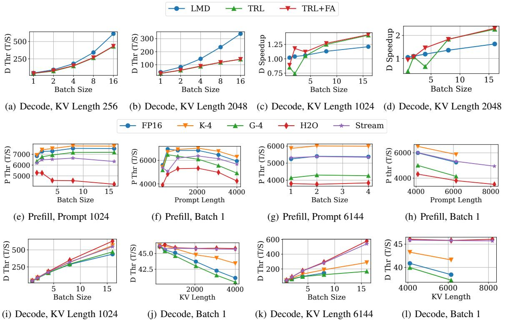 -->

# 每日精选

- **[QSERVE:](#qserve-w4a8kv4-quantization-and-system-co-design-for-efficient-llm-serving-4)** W4A8KV4 QUANTIZATION AND SYSTEM CO-DESIGN FOR EFFICIENT LLM SERVING: 提出QoQ渐进式分组量化算法，结合W4A8KV4混合精度和系统级优化（如计算感知权重重排、寄存器级并行），实现所有GEMM计算在高吞吐量INT8张量核心上运行，显著提升推理速度和内存效率，同时通过SmoothAttention缓解KV4量化带来的精度损失，整体在保持准确率的同时实现高达3.5倍的加速。
- **[LEANATTENTION: HARDWARE-AWARE SCALABLE ATTENTION MECHANISM FOR THE DECODE-PHASE OF TRANSFORMERS](#leanattention-hardware-aware-scalable-attention-mechanism-for-the-decode-phase-of-transformers-2)** : 利用softmax重缩放的结合性，将注意力计算归约为可任意拆分的块，实现LeanTile粒度的灵活并行和stream-K风格的负载均衡分配，极大提升了解码阶段的GPU利用率和可扩展性，解决了长上下文和小查询长度下的并行瓶颈。
- **[ENABLING UNSTRUCTURED SPARSE ACCELERATION ON STRUCTURED SPARSE ACCELERATORS](#enabling-unstructured-sparse-acceleration-on-structured-sparse-accelerators-6)** : 创新性地提出TASD抽象，将非结构化稀疏张量近似为多个结构化稀疏张量之和，使非结构化稀疏模型无需微调即可在结构化稀疏加速器上高效运行，并通过TASDER和TTC软硬件协同设计，实现多模型高能效加速，最高提升EDP 83%且硬件加速达39%。
- **[FLASHINFER: EFFICIENT AND CUSTOMIZABLE ATTENTION ENGINE FOR LLM INFERENCE SERVING](#flashinfer-efficient-and-customizable-attention-engine-for-llm-inference-serving-11)** : 引入统一的块稀疏KV-Cache存储（BSR格式）和可组合稀疏格式，结合JIT编译的可定制注意力内核与兼容CUDA Graphs的动态负载均衡调度，实现多种注意力变体的高效推理，极大提升了内存利用率、吞吐量和适应性，适用于多样化LLM推理场景。

# RETHINKING KEY-VALUE CACHE COMPRESSION TECHNIQUES FOR LARGE LANGUAGE MODEL SERVING

- Wei Gao 1 2 3, Xinyu Zhou 1, Peng Sun 3 4, Tianwei Zhang 1, Yonggang Wen 1
- Nanyang Technological University 1, S-Lab, Nanyang Technological University 2, Shanghai AI Laboratory 3, SenseTime 4

## 核心技术创新

- **跨层KV缓存合并利用深度冗余**：MiniCache开创性地通过合并相邻层中高度相似的KV状态，实现了沿模型深度方向的KV缓存压缩。这一新颖视角揭示了此前仅关注层内冗余方法所忽视的层间冗余，从而在无需重新训练或微调的情况下显著节省内存[[1]](https://proceedings.neurips.cc/paper_files/paper/2024/file/fd0705710bf01b88a60a3d479ea341d9-Paper-Conference.pdf)。
- **带方向插值的重参数化保持语义**：MiniCache并非简单地对KV缓存向量进行平均，而是将其分解为大小和方向两部分，利用球面线性插值（SLERP）合并方向，同时保持原始范数。该几何方法保留了关键的语义和句法信息，最大限度地减少压缩过程中的准确率损失[[1]](https://proceedings.neurips.cc/paper_files/paper/2024/file/fd0705710bf01b88a60a3d479ea341d9-Paper-Conference.pdf)。
- **选择性保留token保障信息完整**：鉴于部分跨层token对存在较大语义差异，MiniCache引入保留机制，保持这些“不可合并”token不变。此针对性保护避免了盲目合并带来的性能下降，实现了压缩率与信息保真度的平衡[[1]](https://proceedings.neurips.cc/paper_files/paper/2024/file/fd0705710bf01b88a60a3d479ea341d9-Paper-Conference.pdf)。
- **全面评估揭示实际权衡**：实证研究表明，KV缓存压缩虽能降低内存占用并在高负载下提升吞吐量，但往往导致响应长度增加及特定任务准确率不均匀下降。这些发现凸显了压缩率、计算效率与输出质量之间的复杂关系，呼吁采用更全面的评估指标，超越单一的整体准确率和吞吐量。

图1：LLaMA-7B的吞吐量分析：（a-b）TRL（含FlashAttention与不含FlashAttention）和LMDeploy（LMD）上的FP16解码吞吐量。（c-d）StreamingLLM算法在TRL和LMD上的加速比。（e-h）不同输入大小的预填充吞吐量。（i-l）不同输入大小的解码吞吐量。

例如，图1展示了不同压缩方法和服务框架下的吞吐量变化，强调了实际部署的复杂性。这些创新共同推动KV缓存压缩从理论潜力迈向兼顾算法设计与部署挑战的实用生产解决方案。

## 启示

- **压缩与实际部署的平衡**：尽管KV缓存压缩在内存节省方面表现出色，但在吞吐量和延迟方面仍面临现实挑战，尤其是响应长度增加和任务特定准确率下降。未来产品设计必须整合自适应机制，权衡这些因素，而非单纯追求压缩率。
- **预测工具助力生产应用**：吞吐量和响应长度预测器的引入，为动态调度请求和决定压缩时机提供了实用路径。此方法可缓解延迟峰值和准确率下降，表明下一代LLM服务系统应内嵌此类智能调度器，以优化资源利用和用户体验。
- **任务感知压缩策略至关重要**：压缩对摘要和问答等任务影响不均，凸显了任务特定或输入感知压缩策略的必要性。结合轻量级任务分类器或自适应压缩级别，能显著减少负面样本，提升商业部署的鲁棒性。
- **探索互补压缩维度**：MiniCache利用层间KV缓存冗余的创新，揭示了传统量化和稀疏性之外的潜力。将此类正交方法结合，可在保持准确率和吞吐量的同时，进一步提升压缩率，指引未来研究和产品路线向多维压缩框架发展[[1]](https://proceedings.neurips.cc/paper_files/paper/2024/file/fd0705710bf01b88a60a3d479ea341d9-Paper-Conference.pdf)。

# LEANATTENTION: HARDWARE-AWARE SCALABLE ATTENTION MECHANISM FOR THE DECODE-PHASE OF TRANSFORMERS

- Rya Sanovar 1, Srikant Bharadwaj 1, Renee St. Amant 1, Victor Ruhle 1, Saravan Rajmohan 1
- Microsoft 1

## 核心技术创新

- **关联性softmax重缩放实现灵活的工作负载拆分**：LeanAttention利用softmax重缩放算子的结合性，将注意力计算视为归约操作。这使得可以将键值工作负载拆分为任意大小的块而不损失精确性，从而实现超越固定大小分区的灵活高效并行化。

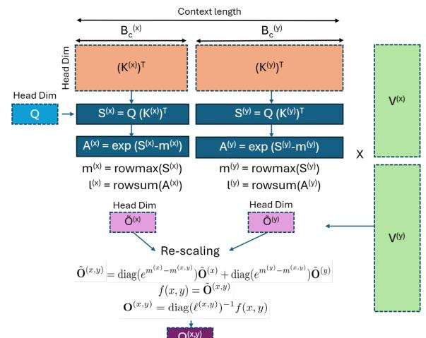

[图4](#figure-4)：示意图展示LeanAttention的分区策略，将一个头的两种不同大小的工作量分配给不同的CTA。未缩放的输出独立计算，随后在归约操作中重新缩放。注意，这可以推广到任意大小的工作量拆分。

[图4](#figure-4)展示了不同大小的工作量如何独立计算并通过重缩放合并。
- **LeanTile：硬件映射的最优粒度**：该机制定义了一个最小计算单元LeanTile，代表上下文维度上的一小块token。通过经验确定的tile大小（例如，A100 GPU上头大小为64时为256个token）最大化计算效率和内存访问，作为跨GPU流多处理器分配工作负载的构建块。
- **Stream-K风格分解实现负载均衡分配**：LeanAttention采用受stream-K启发的线性映射，将LeanTiles分布到所有计算单元，确保几乎完美的负载均衡和接近100%的GPU占用率，无论问题规模或硬件配置如何。这与先前固定拆分方法在长上下文和小查询长度的解码阶段负载不均和资源利用不足形成鲜明对比。

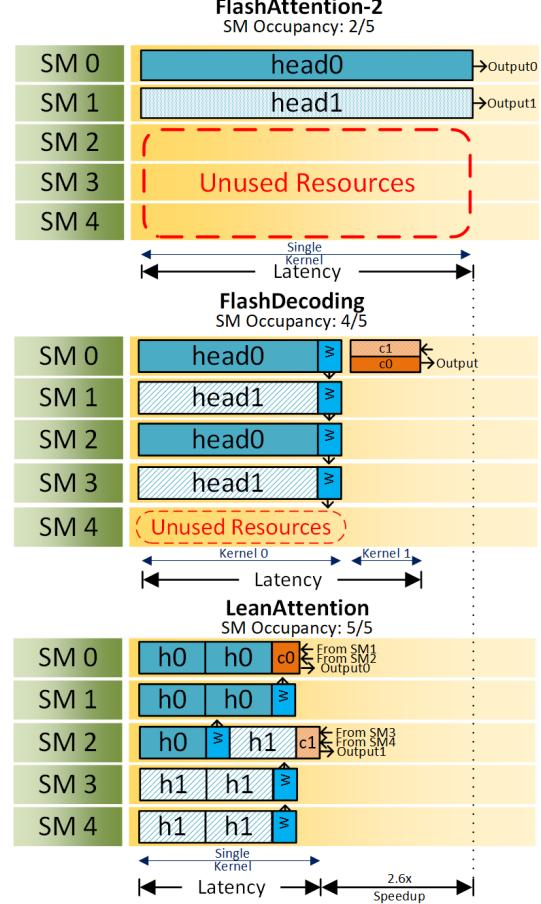

[图1](#figure-1)：FlashAttention-2 [\(Dao,](#page-11-0) [2023\)](#page-11-0)、FlashDecoding [\(Dao et al.\)](#page-11-0)（固定拆分）和LeanAttention在假设的5个SM GPU上对2个头的注意力执行调度。LeanAttention将上下文拆分为最优的LeanTiles（每个头5个tile）。

[图1](#figure-1)生动对比了LeanAttention与FlashAttention-2和FlashDecoding的均衡执行调度。
- **统一内核执行，最小同步开销**：整个注意力计算，包括部分输出生成和独特的softmax重缩放归约，都在单个内核启动中完成。主机CTA协调归约阶段，非主机CTA将部分结果写入全局内存，最大限度减少同步开销，实现可扩展的多GPU执行。

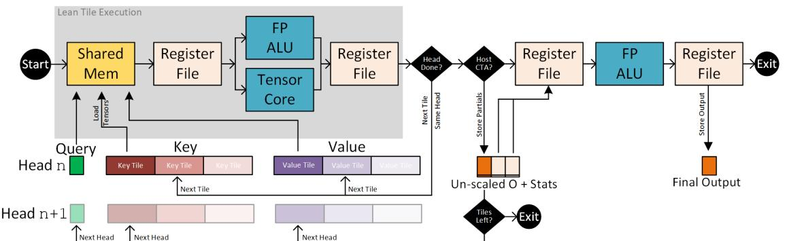

[图5](#figure-5)：LeanAttention中单个CTA的控制和数据流，利用多种硬件资源。张量以tile方式加载到共享内存。头计算结束时，若为主机CTA则执行归约，否则将未缩放的部分结果写入内存，然后继续下一个头的计算。

[图5](#figure-5)详述了单个CTA内的控制和数据流。
这些创新共同解决了解码阶段注意力中的关键瓶颈——即并行效率低、硬件利用不足以及极长上下文的可扩展性挑战——相较于最先进方法实现了显著的加速和能效提升。

## 启示

- **硬件感知的并行性是未来大规模语言模型加速的关键**：LeanAttention通过智能平衡计算单元间的工作负载，实现接近100%的GPU占用率，表明下一代AI硬件和软件必须协同设计针对不同推理阶段（尤其是解码阶段）的并行策略，避免先前方法中出现的资源利用不足问题。
- **可扩展且精确的注意力机制支持长上下文大模型**：利用softmax重缩放的结合性和stream-K风格的分区，LeanAttention在保持精确性的同时高效扩展至极长上下文（数十万token级别）。这表明未来AI硬件产品应优先考虑灵活且数学基础扎实的分区方案，以支持新兴的超长上下文应用，且不牺牲准确性和速度。

# PIPEFILL: USING GPUS DURING BUBBLES IN PIPELINE-PARALLEL LLM TRAINING

- Daiyaan Arfeen 1, Zhen Zhang 2, Xinwei Fu 2, Gregory R. Ganger 1, Yida Wang 2
- Carnegie Mellon University 1, Amazon Web Services 2

## 核心技术创新

- **利用独立作业填充流水线气泡的创新方法**：PIPEFILL 首创利用大规模流水线并行训练中因流水线气泡导致的 GPU 空闲时间，执行与主训练任务无关的*独立*填充作业。这突破了以往仅用依赖或辅助计算填充气泡的做法，实现了更广泛的适用性和更高的 GPU 利用率，同时不影响主作业。  
- **精确的气泡特征描述与内存管理**：通过引入新颖的*流水线气泡指令*，PIPEFILL 实时准确测量气泡持续时间和可用 GPU 内存。系统动态释放临时内存并将优化器状态卸载至 CPU 内存，确保填充作业在严格的气泡约束内运行，避免内存溢出错误，这是安全多路复用 GPU 负载的关键进展。  
- **自适应填充作业执行规划与上下文切换**：系统的执行器将填充作业划分为细粒度计算图段，针对气泡长度和内存限制进行定制，协调无缝上下文切换，确保填充作业严格限制在气泡内执行。这保证了对主训练作业的开销极低（<2%），同时最大化填充作业吞吐量。  
- **灵活的策略驱动填充作业调度**：PIPEFILL 的调度器基于用户定义的策略和气泡特征，智能匹配填充作业与异构流水线气泡，平衡利用率最大化或截止时间遵守等目标。  

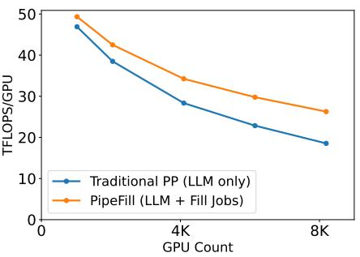

[图 1](#figure-1)：将一个 400 亿参数的 LLM 训练规模从 1000 个 GPU 扩展到 8000 个 GPU，训练时间从 82 天缩短至 26 天。传统上，扩展时流水线气泡增加，导致 8000 GPU 时 GPU 利用率降低超过 60%。PIPEFILL 能够利用大量气泡 GPU 时间执行有用工作，而不减慢 LLM 训练速度。第 [4 节](#page-6-0) 详细介绍了实验设置。

该模块化调度框架实现了跨多样化工作负载和动态集群条件的高效资源共享。  
这些架构和算法创新使 PIPEFILL 能够在极大规模（如 8000 GPU 训练 400 亿参数 LLM）下恢复高达 63% 的流水线气泡导致的 GPU 利用率损失，有效将闲置 GPU 周期转化为生产性工作，同时不影响训练速度和模型质量，如[图 1](#figure-1)所示。这一突破解决了大规模模型训练扩展的根本瓶颈，开启了 AI 硬件利用效率的新前沿。

## 启示

- **通过机会调度释放 GPU 效率**：PIPEFILL 通过用独立作业填充流水线气泡，展示了大规模 LLM 训练中显著提升 GPU 利用率的可行路径。这表明未来 AI 硬件系统应采用动态、细粒度的资源共享，而非刚性独占分配，从而在不影响主作业的前提下提升集群整体吞吐量。  
- **异构工作负载的战略整合**：PIPEFILL 在流水线空闲阶段同时运行训练和批量推理填充作业的成功，凸显了工作负载异构性的价值。AI 硬件公司可据此设计下一代调度器和内存管理方案，实现多样 AI 任务的无缝交织，最大化硬件投资回报率，支持现实部署中混合 AI 服务需求。

# QSERVE: **W4A8KV4** QUANTIZATION AND SYSTEM CO-DESIGN FOR EFFICIENT LLM SERVING

- Yujun Lin 1, Haotian Tang 1, Shang Yang 1, Zhekai Zhang 1, Guangxuan Xiao 1, Chuang Gan 2 3, Song Han 1 4
- MIT 1, UMass Amherst 2, MIT-IBM Watson AI Lab 3, NVIDIA 4

## 核心技术创新

- **高效INT8 GEMM的渐进式分组量化（Progressive Group Quantization）**：QoQ算法创新性地采用两级量化——首先进行带保护范围的每通道INT8量化，然后进行每组INT4量化，确保中间反量化权重保持在INT8范围内。这使得所有GEMM计算均可在高吞吐量的INT8张量核心上运行，显著减少了主循环中昂贵的反量化开销，相较于之前的W4A4或W4A16方法有明显提升。

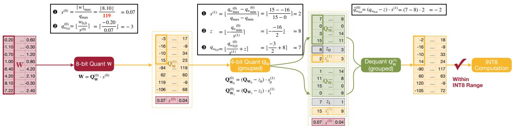

[图6](#figure-6)：渐进式分组量化首先采用带保护范围[-119, 119]的每通道INT8量化，随后进行每组INT4量化，使得反量化的中间值保持在INT8范围内进行计算。

[图6](#figure-6)展示了该保护量化范围的概念。
- **SmoothAttention缓解KV4量化精度损失**：为解决激进的4位KV缓存量化带来的精度下降，SmoothAttention选择性地缩放Key缓存中的异常通道，平滑激活分布，同时不对Query进行量化。

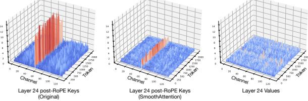

[图7](#figure-7)：SmoothAttention有效平滑了Key中的异常值。Value不受异常值影响。

这种针对性的平滑保持了模型的准确性，同时实现了KV4的内存和速度优势，如[图7](#figure-7)所示。
- **计算感知的权重重排以最小化指针运算**：QServe重新组织权重存储以匹配计算访问模式，支持高效的128位内存事务，极大减少CUDA核心上的指针运算开销。

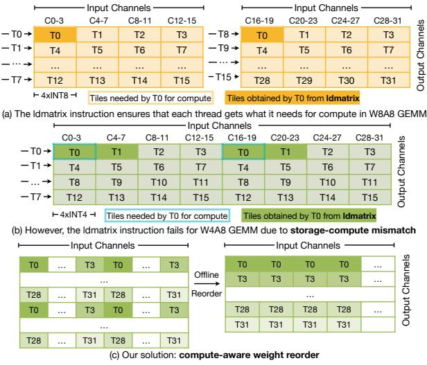

[图9](#figure-9)：QServe应用计算感知的权重重排，最小化**W4A8** GEMM主循环中的指针运算。

该系统级优化克服了现有GPU指令无法处理W4A8 GEMM中存储与计算数据类型不匹配的限制，详见[图9](#figure-9)。
- **寄存器级并行与乘法后减法反量化**：通过精心安排反量化操作顺序，QServe利用GPU向量指令同时解码多个INT4权重且无溢出，实现了完整的寄存器级并行。

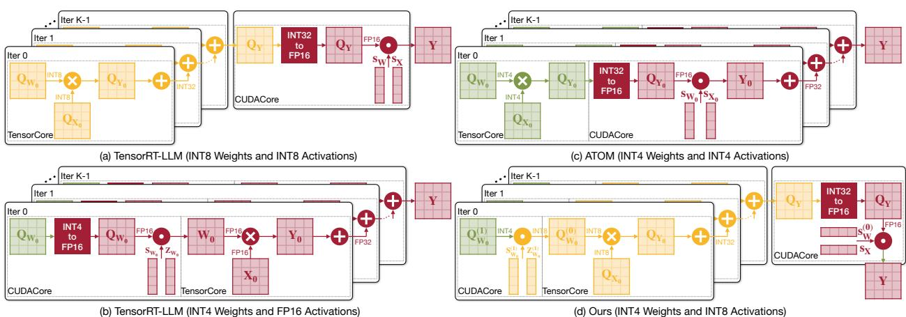

[图5](#figure-5)：GPU上的量化GEMM：**W8A8**速度快，因为其主循环仅包含*张量核心*操作，所有反量化操作均在尾声阶段完成。Atom-**W4A4**和TensorRT-LLM-**W4A16**在主循环中存在显著的部分和或权重反量化开销。得益于两级渐进量化算法，QServe-**W4A8**通过引入寄存器级并行减少了主循环的反量化开销。

这降低了主循环对慢速CUDA核心操作的依赖，解决了以往低位量化方案的关键瓶颈（参见[图5](#figure-5)和[图10](#figure-10)）。
这些创新综合调和了低位量化的理论吞吐优势与实际GPU架构限制，实现了相较于最先进系统高达3.5倍的加速，同时保持了竞争力的准确率。

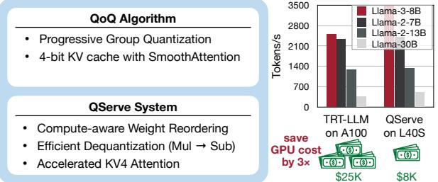

[图1](#figure-1)：QServe在L40S上运行Llama模型时的吞吐量高于A100上的TensorRT-LLM，通过系统与算法协同设计有效节省了3倍的LLM服务成本。具体吞吐量和TensorRT-LLM的精度选择见表[5](#page-16-0)。

量化算法与系统级优化的协同设计标志着现代GPU上高效LLM服务的重大飞跃[[图1](#figure-1)]。

## 启示

- **精度与效率的平衡至关重要**：QoQ量化和QServe系统表明，精心设计的混合精度方案如W4A8KV4能够在不牺牲准确率的前提下释放更高吞吐量，挑战了“位宽越低推理越快”的传统认知。这种平衡对面向云规模LLM服务的下一代AI硬件尤为关键。
- **系统与算法协同设计推动突破**：QServe的成功强调了算法创新（渐进量化、SmoothAttention）必须与硬件感知的系统优化（计算感知权重重排、寄存器级并行）紧密结合，才能突破GPU架构瓶颈，树立AI推理加速的新范式。
- **动态细粒度量化实现可扩展性**：QServe中KV缓存的逐头动态量化表明，静态粗粒度量化不足以支持激进的位宽压缩。未来AI硬件和软件栈应采用自适应量化粒度，以在保持准确率的同时最大化内存和计算效率。
- **成本效益显著的LLM服务重塑市场格局**：在更经济的GPU（如L40S优于A100）上实现2-3倍吞吐量提升，预示着大型模型部署的民主化趋势。AI硬件公司可利用此类量化驱动的效率提升，面向更广泛的云端和边缘市场，降低总体拥有成本（TCO）。

# CONTEXT PARALLELISM FOR SCALABLE MILLION-TOKEN INFERENCE

- Amy (Jie) Yang 1, Jingyi Yang 1, Aya Ibrahim 1, Xinfeng Xie 1, Bangsheng Tang 1, Grigory Sizov 1, Jeremy Reizenstein 1, Jongsoo Park 1, Jianyu Huang 1
- Meta Platforms, Inc. 1

## 核心技术创新

- **长上下文扩展的上下文并行（Context parallelism）**：核心创新在于将输入的序列长度上的token分布到多个GPU上，实现极长上下文（最多可达100万token）的近线性延迟扩展。这与传统的张量并行或流水线并行不同，重点在于减少通信开销并平衡节点间计算负载，对于大规模实时LLM推理至关重要。
- **无损环形注意力变体（pass-KV和pass-Q）**：提出两种新型环形注意力算法，根据KV缓存命中率和上下文长度动态切换传递key-value（KV）或query（Q）嵌入。这种自适应策略最小化通信瓶颈，并实现通信与计算的重叠，优化了全填充（prefill）、部分填充和解码阶段的延迟。
- **因果注意力的负载均衡分片**：为解决因果注意力的顺序依赖导致的负载不均问题，将输入序列划分为交错的块，分配给不同的rank，确保注意力计算和KV缓存内存的均匀分布。

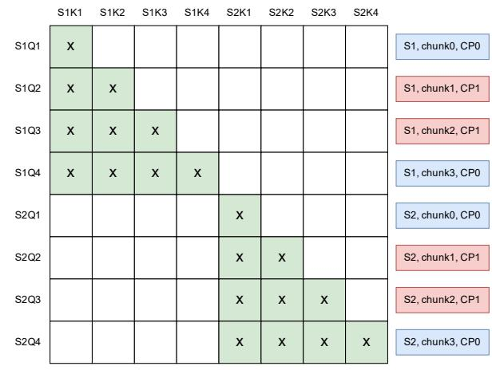

[图1](#figure-1)：在全填充阶段，使用2个上下文并行rank（CP2）进行负载均衡的CP分片与融合输入。我们有2个输入序列：S1，S2。每个序列均匀划分为4个块：Qi / Ki，i=1,2,3,4。

该技术保持了可扩展性，防止多轮推理中的内存溢出（见[图1](#figure-1)）。
- **上下文并行与张量并行的无缝集成**：系统结合了跨节点的上下文并行和节点内的张量并行，发挥两者优势。

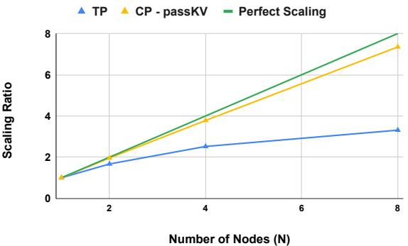

[图7](#figure-7)：上下文并行与多节点张量并行的扩展比（单节点延迟除以N节点延迟）。

这种混合方法在大型GPU集群上实现了高达63%的FLOPS利用率和93%的扩展效率，尤其在通信开销和延迟降低方面优于多节点张量并行（见[图7](#figure-7)）。
这些创新共同重新定义了长上下文LLM推理的系统级优化，实现了对前所未有的token长度的精确注意力，无需架构变更。它们为未来结合近似检索方法和架构进展以进一步控制超长上下文处理复杂性开辟了道路。

## 启示

- **预填充与解码的解耦以优化服务**：上下文并行的优势在于显著降低长上下文的预填充延迟，而解码延迟可能随扩展而恶化。这表明未来LLM服务系统应在架构上分离预填充和解码工作负载，以充分利用上下文并行的优势，同时保证实时响应能力。
- **超长上下文的混合精确-近似方法**：由于百万token上下文的精确注意力面临收益递减和二次成本，将上下文并行的可扩展精确注意力与近似检索或稀疏注意力方法结合，成为平衡延迟、内存和准确性的下一代LLM应用的有前景方向。

# ENABLING UNSTRUCTURED SPARSE ACCELERATION ON STRUCTURED SPARSE ACCELERATORS

- Geonhwa Jeong 1, Po-An Tsai 2, Abhimanyu Bambhaniya 1, Stephen W. Keckler 2, Tushar Krishna 1
- Georgia Institute of Technology 1, NVIDIA 2

## 核心技术创新

- **将模型稀疏性与硬件约束解耦：** TASD 引入了一种新颖的抽象层，将任意非结构化稀疏张量近似为多个结构化稀疏张量的和。这打破了深度神经网络剪枝模式与硬件支持的稀疏性之间的紧耦合，使非结构化稀疏模型能够在现有结构化稀疏加速器上高效运行，无需昂贵的微调或重新训练。  
- **利用张量代数的分配律：** 通过将非结构化稀疏矩阵分解为一系列结构化稀疏分量，TASD 利用分配律将矩阵乘法转化为结构化稀疏乘法的求和。这使得在针对结构化稀疏模式（如 N:M）优化的硬件上实现无缝加速成为可能，同时保持高近似质量并最大限度减少精度损失。  
- **与 TASDER 和 TTC 的软硬件协同设计：** TASDER 框架自动搜索每个 DNN 层的最优 TASD 配置，平衡近似激进度与准确性。配合使用的 TASD Tensor Core (TTC) 架构，在现有结构化稀疏加速器基础上仅增加约 2% 的面积开销，有效支持多种结构化稀疏模式和激活的动态运行时分解，拓宽了其在稠密和稀疏 DNN 中的广泛适用性。  
- **对性能和能效的广泛影响：** TASD 在多种模型（包括 ResNet 和 BERT）上实现了高达 83% 的能量延迟积（EDP）提升和高达 39% 的实际硬件加速（如 NVIDIA RTX 3080 GPU），且无需任何模型微调。  

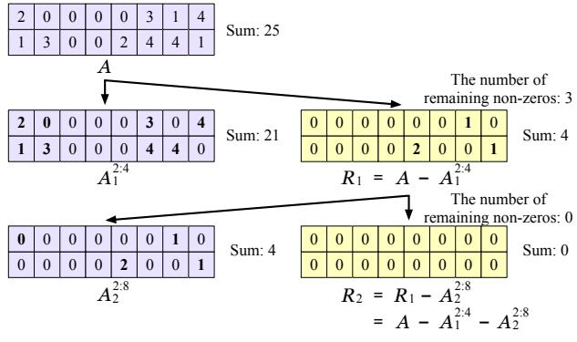

[图4](#figure-4)：使用 2×8 矩阵 A 的 TASD 示例。

该方法还通过基于幅值的启发式方法优雅地处理激活稀疏性和非 ReLU 激活，扩展了其在先前结构化稀疏方法之外的实用性。  
[图4](#figure-4) 展示了将非结构化稀疏矩阵分解为结构化稀疏分量的核心 TASD 概念，突出其如何实现灵活且硬件友好的加速，同时保持准确性。这一创新从根本上重新定义了稀疏加速的挑战，架起了灵活模型稀疏性与高效硬件执行之间的桥梁。

## 启示

- **架起模型灵活性与硬件效率的桥梁：** TASD 解耦了 DNN 稀疏模式与硬件支持之间的紧耦合，使非结构化稀疏模型能够在结构化稀疏加速器上高效运行且无需微调。这开辟了一个新范式，使模型开发者可以优先考虑准确性和稀疏表达能力，而硬件设计者则专注于高效的结构化稀疏支持。  
- **动态分层适应性是关键推动力：** TASD 的成功依赖于其分层配置和运行时适应性，尤其针对具有动态稀疏性的激活。这表明未来的 AI 硬件应集成灵活、可编程的稀疏处理单元和类似 TASDER 的协同优化框架，以最大化不同模型和工作负载的性能与能效提升。

# THE HIDDEN BLOAT IN MACHINE LEARNING SYSTEMS

- Huaifeng Zhang 1, Ahmed Ali-Eldin 1
- Chalmers University of Technology 1

## 核心技术创新

- **针对CPU和GPU代码的双层去膨胀技术**：Negativa-ML独特地扩展了传统的去膨胀方法，既针对机器学习共享库中的CPU（主机）代码，也针对GPU（设备）代码进行处理。

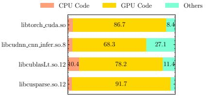

[图1](#figure-1)：PyTorch中排名前四的最大共享库中CPU代码和GPU代码的分布。

这一双重关注解决了此前被忽视的膨胀源——GPU代码，GPU代码构成了机器学习框架二进制文件的主要部分，如PyTorch最大库中GPU代码占比所示（[图1](#figure-1)）。
- **通过CPU级拦截实现轻量级内核检测**：内核检测器不采用代价高昂的GPU运行时追踪，而是在CPU端钩取CUDA驱动的`cuModuleGetFunction`调用，低开销地捕获内核使用情况。

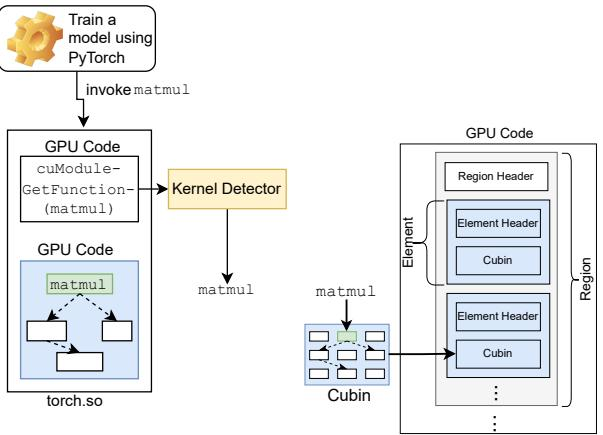

[图3](#figure-3)：内核检测器工作示意。

这一新颖思路利用内核调用图结构，仅检测CPU发起的内核，同时间接涵盖GPU发起的内核，从而在准确性和效率之间取得平衡（[图3](#figure-3)）。
- **通过cubin映射实现近似但稳健的GPU内核定位**：鉴于缺乏公开的GPU代码结构规范，内核定位器不追求精确定位内核，而是识别并保留包含已使用内核的整个cubin（CUDA二进制块）。

[图4](#figure-4)：GPU代码结构示意。

该方法确保保留调用图中所有相关GPU内核，保持正确性，同时允许安全移除未使用的代码段（[图4](#figure-4)）。
- **与成熟的压缩阶段集成，实现可靠的二进制重写**：基于已有的Negativa工具，Negativa-ML复用三阶段去膨胀流程——检测、定位和压缩，安全地剔除未使用代码。压缩阶段将未使用文件区间置零并重新映射偏移，保证内存地址有效性，确保去膨胀后的共享库在无源码情况下仍能正常运行。
这一架构洞察、创新内核检测和务实GPU代码处理的结合，显著超越了以往仅关注CPU代码的去膨胀工作，实现了机器学习框架膨胀和运行时资源消耗的大幅降低。

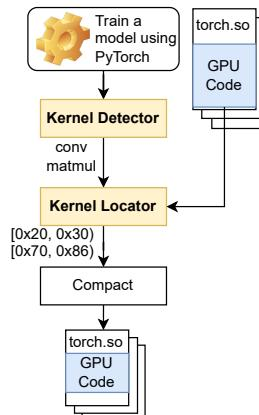

[图2](#figure-2)：Negativa-ML概览。本文提出的组件以黄色矩形标出。

该方法在多框架和多工作负载上的通用性进一步凸显其实用价值（[图2](#figure-2)）。

## 启示

- **优先优化机器学习框架中的GPU代码**：鉴于GPU代码构成了机器学习共享库中大部分膨胀和开销，聚焦GPU代码的去膨胀和优化能显著降低资源消耗并提升运行效率。
- **利用工作负载特定的去膨胀以适应部署需求**：由于少数共享库占据大部分膨胀，且不同工作负载共享大量常用函数，针对部署场景的定向去膨胀可在不牺牲正确性和性能的前提下，大幅减少存储和内存占用。

# AIOPSLAB: A HOLISTIC FRAMEWORK TO EVALUATE AI AGENTS FOR ENABLING AUTONOMOUS CLOUDS

- Yinfang Chen 1, Manish Shetty 2, Gagan Somashekar 3, Minghua Ma 3, Yogesh Simmhan 4, Jonathan Mace 3, Chetan Bansal 3, Rujia Wang 3, Saravan Rajmohan 3
- UIUC 1, UC Berkeley 2, Microsoft 3, IISc 4

## 核心技术创新

- **通过 Orchestrator 和 ACI 实现统一的代理-云交互：** AIOPSLAB 引入了一个中央 Orchestrator，负责通过定义良好的 Agent-Cloud Interface（ACI）调节 AI 代理与云环境之间的所有交互。该抽象将复杂的云操作简化为简洁的 API（如 get_logs、get_metrics、exec_shell），使代理能够无缝执行从检测到缓解的多样任务，这相比于分散的工具链是一个重大飞跃。
- **全面的任务分类与真实故障注入：** 该框架将运维任务划分为检测、定位、根因分析和缓解，覆盖完整的事件生命周期。它支持症状性故障（如 pod 故障）和更深层次的功能性故障（如认证撤销），允许评估代理在诊断和纠正能力上的表现，超越表面症状，推动自主云管理的前沿。
- **动态且可扩展的问题池，支持多环境：** 通过集成多样的微服务应用和负载生成器，以及可扩展的故障库，AIOPSLAB 能够在多个云栈中实例化 100 多个真实且参数化的问题。这使得对 AI 代理在复杂且不断演进环境中的适应性和鲁棒性进行严格基准测试成为可能，显著优于静态或孤立的数据集。
- **全面的可观测性与评估机制：** 平台通过集成 Prometheus 和 Jaeger 等工具收集多模态遥测数据（指标、日志、追踪），为代理提供丰富的上下文信息，并支持细粒度的性能指标，如检测时间（Time-to-Detect）和缓解时间（Time-to-Mitigate）。此外，还支持基于大语言模型（LLM）的代理推理定性评估，促进对代理行为和失败模式的深入理解。

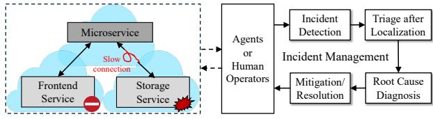

图 1：微服务事件及其管理生命周期的简化版本。

这些创新共同确立了 AIOPSLAB 作为一个开创性框架，不仅用于基准测试，还推动了能够实现端到端事件管理的自主 AIOps 代理的发展，向图 1 所示的自愈云系统愿景迈进。

## 启示

- **全面评估推动 AgentOps 成熟：** AIOPSLAB 的综合交互式基准测试表明，自主代理必须超越孤立任务处理，向集成的跨层事件管理演进。这强调了下一代 AI 硬件产品需要支持多模态数据处理和复杂云环境中的实时决策编排。
- **精细反馈与任务分解至关重要：** 尽管交互步骤增多，代理性能趋于瓶颈，表明更丰富、结构化的反馈和更智能的任务拆解将是关键。AI 硬件公司应优先考虑支持低延迟、上下文感知推理的架构，以赋能代理实现迭代自我提升能力。

# GSPLIT: SCALING GRAPH NEURAL NETWORK TRAINING ON LARGE GRAPHS VIA PROBABILISTIC SPLITTING

- Sandeep Polisetty 1, Juelin Liu 1, Jacob Falus 1, Yi Ren Fung 2, Seung Hwan Lim 3, Hui Guan 1, Marco Serafini 1
- University of Massachusetts, Amherst 1, University of Illinois Urbana-Champaign 2, Oak Ridge National Laboratory 3

## 核心技术创新

- **Split parallelism 消除 GNN 训练中的冗余**：与传统的数据并行方法在多个 GPU 上重复采样、加载和计算重叠子图不同，split parallelism 将每个小批量数据划分为不重叠的子集，分配给不同的 GPU。这样确保每个顶点的特征和计算仅由一个 GPU 处理，大幅减少冗余工作，提高效率。

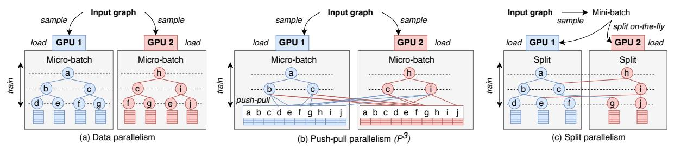

[图 1](#figure-1)：数据并行、推拉并行与提出的 split parallel 训练方法的对比。

[图 1](#figure-1) 直观展示了该方法与现有方法的区别。
- **概率划分算法实现负载均衡并最小化通信**：为了实现高效的动态划分，系统采用了一种新颖的概率划分算法，先通过离线预采样为顶点和边赋权，然后应用加权最小边割划分。该方法在理论上保证了最小化预期的跨 GPU 通信量和负载均衡，克服了实时精确划分的 NP 难题。
- **面向层的 API 保持编程抽象和内核复用**：GSplit 引入了面向层的 split/shuffle API，抽象了跨 GPU 的数据洗牌过程，允许复用经过优化的单 GPU 采样和训练内核。该设计保持了熟悉的编程模型，支持多样的 GNN 架构，无需针对模型进行特定改动，区别于基于边的替代方案。
- **集成采样、加载和训练的完整流水线**：训练流水线紧密结合 split parallelism 与协同采样和特征加载，利用 shuffle 索引高效交换前向和反向传播中的中间顶点特征。

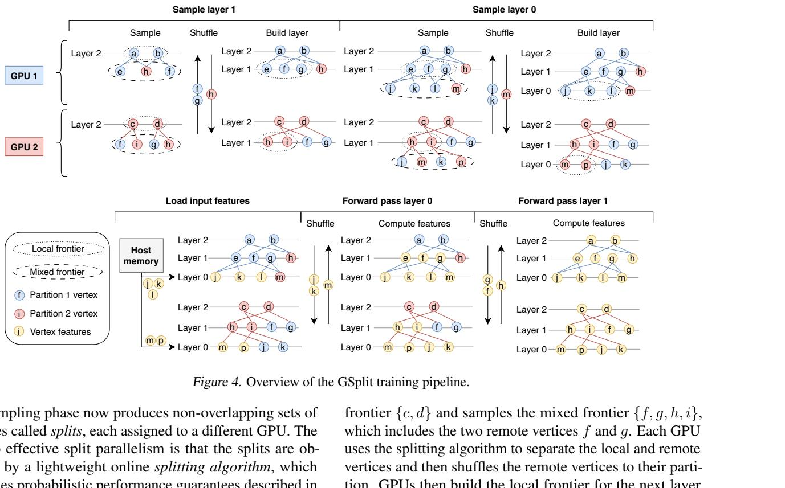

[图 4](#figure-4)：GSplit 训练流水线概览。

该端到端设计在消除冗余的同时平衡通信开销，实现了相较于最先进系统的显著加速，并保持了准确性 [[图 4](#figure-4)]。

## 启示

- **重新思考 GNN 训练的并行策略**：split parallelism 的成功挑战了纯数据并行的主导地位，证明消除冗余计算和数据加载能够在多 GPU 系统上带来显著加速和更好扩展性。这表明未来 AI 硬件设计应采用针对工作负载特征的混合并行模型，而非默认复制式方法。
- **概率算法实现实用的可扩展性**：采用概率划分算法将大部分复杂度转移到离线处理，同时提供预期保证，是一种强有力的范式。它在不依赖昂贵在线计算的情况下平衡通信开销和负载，凸显了基于原理的近似方法如何开启分布式 AI 训练系统的新性能边界。

# ADAPARSE: AN ADAPTIVE PARALLEL PDF PARSING AND RESOURCE SCALING ENGINE

- Carlo Siebenschuh 1 2, Kyle Hippe 1 2, Ozan Gokdemir 1 2, Alexander Brace 1 2, Arham Khan 1, Khalid Hossain 2, Yadu Babuji 2, Nicholas Chia 2, Venkatram Vishwanath 2, Rick Stevens 1 2, Arvind Ramanathan 1 2, Ian Foster 1 2, Robert Underwood 2
- Department of Computer Science, University of Chicago 1, Argonne National Laboratory 2

## 核心技术创新

- **通过分层分类实现自适应解析器选择：** AdaParse 引入了一个多阶段决策流程，首先进行快速文本提取（PyMuPDF），并利用粗略特征快速评估文本质量。

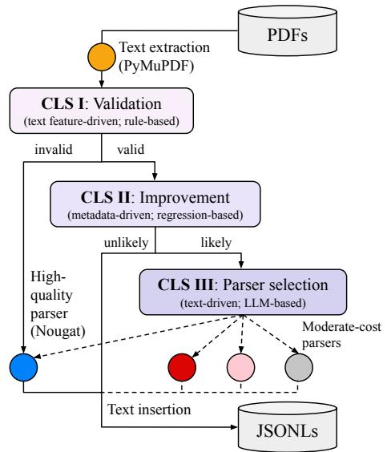

[图2](#figure-2)：一系列预测模型的系统架构图：在初步文本提取步骤（PyMuPDF）之后，PDF 文件通过分层分类流程。CLS I 通过粗略但计算快速的特征（如文本长度）预测提取文本的二元质量属性。对于有效文本，CLS II 评估是否有其他解析器可能带来改进。如果是，CLS III 选择最有可能提升输出文本质量的解析器。

后续的分类阶段预测是否需要更高质量的解析器，并相应选择最优解析器，实现了针对每个文档动态平衡准确性和计算成本的目标（[图2](#figure-2)）。这种分层方法有效应对了多样化 PDF 布局和内容类型的复杂性，避免了一刀切解析器的局限性。
- **与人类判断对齐的直接偏好优化（DPO）：** AdaParse 不仅依赖传统的准确率指标如 BLEU 或 ROUGE，而是利用领域专家收集的用户偏好来微调解析器选择模型。通过直接与人类质量感知对齐，解决了现有指标难以捕捉科学正确性和细微文本错误的问题，从而实现更有意义的解析器分配决策。
- **在高性能计算（HPC）系统上的并行与资源感知编排：** 系统结合了基于 CPU 的轻量级解析器和基于 GPU 加速的计算密集型 Vision Transformer 解析器（如 Nougat）。

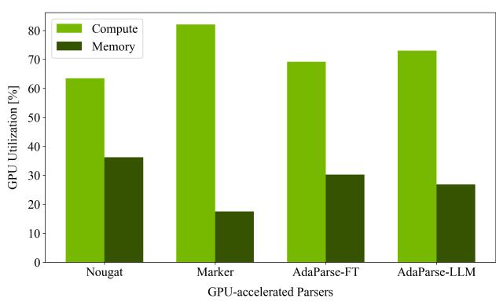

[图4](#figure-4)：使用 NVIDIA Nsight Systems 分析器（Nsys）测量的每个 GPU 的工作负载利用率。

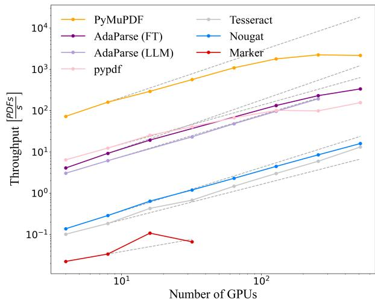

[图5](#figure-5)：七个解析器的可扩展性。

系统采用持久模型加载和批处理策略，最大限度减少开销并提升吞吐量，实现了比最先进解析器快 17 倍的速度，同时保持或提升准确率（[图4](#figure-4)，[图5](#figure-5)）。
- **受提升方法启发的元策略集成：** AdaParse 作为一个自适应集成系统，将每个文档分配给最适合其复杂度和质量需求的解析器。这种方法不同于单一解析方式，利用提取、OCR 和基于 ViT 的方法的互补优势，从而提升整体解析质量和效率，超越任何单一解析器的能力。

## 启示

- **自适应解析作为战略优势：** AdaParse 的数据驱动自适应解析器选择表明，拥抱文档复杂性的异质性能够显著提升准确性和吞吐量。对于 AI 硬件公司，将此类智能编排集成到下一代产品中，可以优化资源利用率并提升大规模科学数据处理中的用户感知质量。
- **与人类对齐的优化释放市场差异化潜力：** 利用直接偏好优化使解析结果与专家人类判断对齐，凸显了即使在自动化流程中引入人类反馈的重要价值。这种方法为科学 AI 应用提供了有力的商业化路径，能够交付更符合领域专家期望的输出，尤其在准确性细节至关重要的场景中表现突出。

# FLASHINFER: EFFICIENT AND CUSTOMIZABLE ATTENTION ENGINE FOR LLM INFERENCE SERVING

- Zihao Ye 1 2, Lequn Chen 3, Ruihang Lai 4, Wuwei Lin 2, Yineng Zhang 5, Stephanie Wang 1, Tianqi Chen 2 4, Baris Kasikci 1, Vinod Grover 2, Arvind Krishnamurthy 1, Luis Ceze 1 2
- Paul G. Allen School of Computer Science & Engineering, University of Washington 1, NVIDIA 2, Perplexity AI 3, Carnegie Mellon University 4, Independent Researcher 5

## 核心技术创新

- **统一的块稀疏KV-Cache存储**：FlashInfer引入了一种多功能的块稀疏行（BSR）格式，统一了多种KV-Cache存储模式，包括页表和基数树。

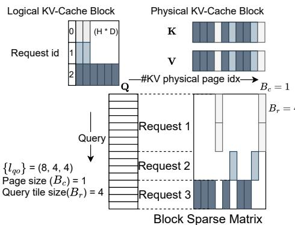

[图2](#figure-2)：BSR格式下页表的表示（Br = 4，Bc = 1）。块稀疏矩阵中的列块数对应页表分配的块总数。非零块表示被查询访问的KV-Cache页。

该抽象通过调整块大小以适应应用需求，实现了高效的内存访问并减少了碎片，如[图2](#figure-2)所示。它有效地将异构存储布局统一到单一硬件友好的表示中。
- **用于共享前缀优化的可组合稀疏格式**：通过将KV-Cache分解为多个具有不同块大小的块稀疏矩阵，FlashInfer利用查询间的共享前缀最大化内存重用和带宽利用。

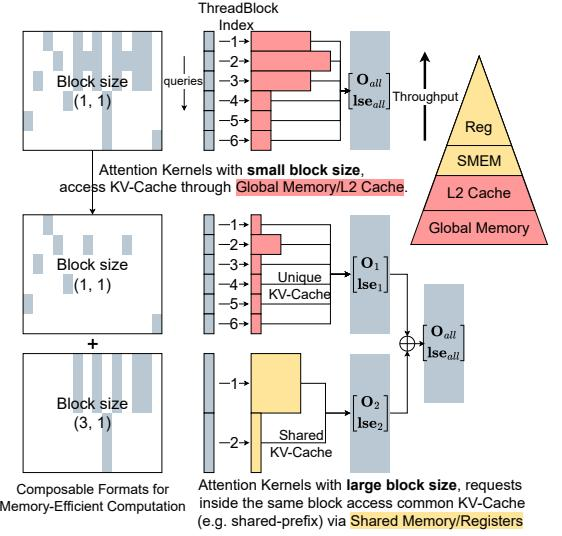

[图3](#figure-3)：注意力计算中共享前缀分解的可组合格式。前6行的查询共享前缀，后6行的查询也共享前缀。对应共享前缀的KV-Cache存储在块大小为(3, 1)的块稀疏矩阵中，剩余唯一的KV-Cache存储在块大小为(1, 1)的块稀疏矩阵中。对于块大小(3, 1)，3个查询可以在高带宽共享内存中共享同一KV-Cache；而块大小(1, 1)中，每个查询在其线程块内访问KV-Cache，只能通过低带宽的全局内存或L2缓存。

该可组合格式允许共享前缀的查询通过高带宽共享内存访问KV-Cache，而唯一后缀使用更小的块，平衡了效率与灵活性（见[图3](#figure-3)）。
- **通过JIT编译实现可定制的注意力内核**：FlashInfer的注意力引擎支持多种注意力变体，采用灵活的CUDA模板和即时编译（JIT）。

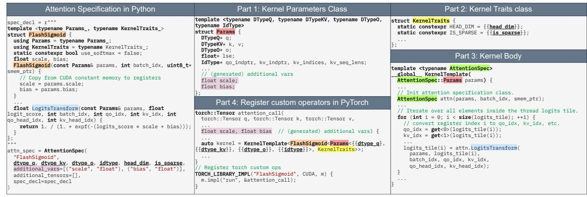

[图5](#figure-5)：FlashInfer中注意力变体的JIT编译器，包含定义变体函数对象的CUDA代码字符串、附加变量/张量和数据类型，用于填充内核模板。对应代码共享高亮显示。

用户可以定义查询/键/值的变换、logits掩码和输出变换作为模块化函数对象，实现对新兴注意力机制的快速适配且不牺牲性能（见[图5](#figure-5)）。该设计超越了传统静态内核，兼顾了可扩展性和硬件特定优化。
- **兼容CUDA Graphs的动态负载均衡调度**：为应对LLM推理中的输入动态性和负载不均，FlashInfer采用运行时调度器，将注意力计算划分为均衡的任务块分配给GPU线程块。

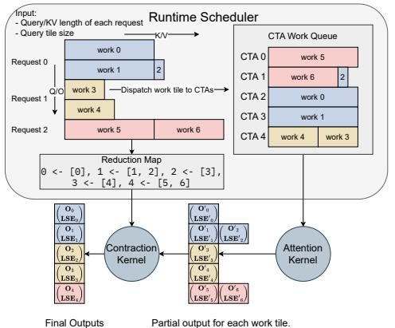

[图6](#figure-6)：FlashInfer的负载均衡运行时调度器，调度器接收查询/输出和键/值维度的序列长度信息以计算计划信息：(1) 每个CTA的工作队列 (2) 部分输出与最终输出的索引映射。计划信息缓存在GPU端，用作持久注意力/收缩内核的输入。

该调度器生成确定性且可重用的计划，兼容CUDA Graphs的静态启动要求，最大化硬件利用率并最小化延迟（见[图6](#figure-6)）。
这些创新共同重新定义了LLM推理中的注意力计算，通过协调内存效率、内核可定制性和动态负载管理，实现了显著的延迟降低和吞吐量提升，适用于多样化的推理场景。

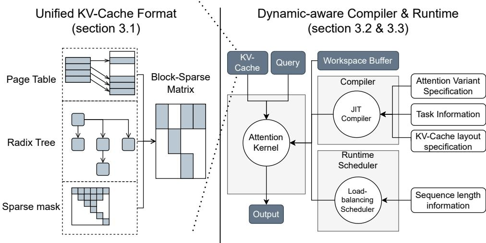

[图1](#figure-1)：FlashInfer系统设计概览：注意力变体规格、任务信息和KV-Cache布局细节在编译时提供用于JIT编译，序列长度信息在运行时输入用于动态调度。

系统设计（见[图1](#figure-1)）将这些组件整合为一个统一框架，能够在编译时和运行时适应不断变化的LLM工作负载。

## 启示

- **定制化作为竞争优势**：FlashInfer的JIT编译和灵活的注意力模板凸显了适应性内核的日益重要性，这类内核能快速跟进新的LLM变体。AI硬件公司应优先考虑模块化、可编程架构，以支持快速创新和多样化工作负载。
- **面向真实工作负载的动态调度**：负载均衡运行时调度器有效处理输入动态性和异构KV-Cache大小，强调静态内核设计的局限。未来产品必须集成智能运行时系统，适应推理模式波动，最大化硬件利用率。

# INTERFERENCE-AWARE EDGE RUNTIME PREDICTION WITH CONFORMAL MATRIX COMPLETION

- Tianshu Huang 1, Arjun Ramesh 1, Emily Ruppel 2, Nuno Pereira 3, Anthony Rowe 1 2, Carlee Joe-Wong 1
- Department of Electrical and Computer Engineering, Carnegie Mellon University 1, Robert Bosch GmbH 2, School of Engineering (ISEP/IPP) and INESC TEC, Polytechnic Institute of Porto 3

## 核心技术创新

- **用于异构归一化的对数残差目标函数**：Pitot 引入了一种对数残差损失，将运行时预测转换为归一化的对数空间，有效处理跨越多个数量级的边缘工作负载和平台的极端异构性。该方法通过关注相对误差而非绝对误差，稳定了训练过程并提升了准确性，这与传统的算术损失函数不同。
- **带有侧信息的双塔神经矩阵分解**：该方法采用双神经嵌入架构，分别对工作负载和平台特征进行编码，映射到共享的潜在空间。这使得能够非线性地建模复杂交互，并利用丰富的侧信息（如操作码计数、CPU 规格），增强了数据效率和在多样边缘设备上的泛化能力。
- **通过学习嵌入实现的干扰感知建模**：Pitot 创新地将工作负载干扰建模为嵌入空间中的低秩矩阵分解项，集成了干扰效应。

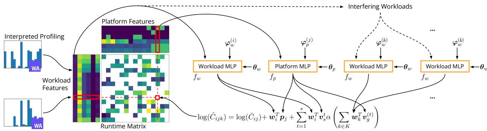

图2：Pitot 的解释性分析、矩阵分解和干扰模型示意。工作负载和平台嵌入向量 \(w_i, p^j\) 由嵌入网络 \(f^w, f^p\) 从输入特征 \(x^{(i)}_w, x^{(j)}_p\) 及学习特征 \(\phi^{(i)}_w, \phi^{(j)}_p\) 计算得到。对于每个（工作负载，平台）对，Pitot 将内积 \(w_i^T p_j\) 加到基线 \(\bar{C}_{ij}\) 上。如果存在干扰模块，Pitot 还计算每个模块的干扰敏感度 \(w_i^T v_t^s\) 和幅度 \(w_k^T v_t^g\)，并添加干扰项（见公式9）。最终预测值与观测运行时进行比较，用于训练模型权重 \(\{\theta_w, \theta_p, \phi_w, \phi_p\}\)。

该方法无需显式微基准测试，即可捕捉共置工作负载间非对称且非线性的干扰模式，显著优于以往基于云或微基准的干扰模型 [图2]。
- **用于不确定性量化的保形化分位数回归**：为了提供统计有效且自适应的运行时界限，Pitot 在分位数回归输出上应用了保形预测校准。

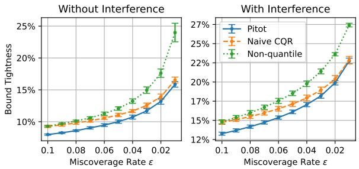

图5：在使用50%数据训练时，针对不同的覆盖率误差，保形化分位数回归算法与简单方法的界限紧度（±2标准误差）比较。

该方法保证了紧凑的概率运行时区间，有助于在不确定性下进行资源配置，优于简单的不确定性方法，支持稳健的边缘编排决策 [图5]。

## 启示

- **边缘运行时预测需要自适应且干扰感知的模型**：Pitot 的成功表明，未来的 AI 硬件产品必须原生集成干扰建模，尤其是在边缘设备日益异构且多租户的背景下。忽视干扰会导致显著的预测误差，强调了硬件与软件协同设计以预见复杂工作负载交互的必要性。
- **不确定性量化是稳健边缘编排的关键**：提供紧凑的概率运行时界限而非单点估计，使得资源分配更智能、调度更具风险感知。这表明下一代边缘平台应内嵌不确定性感知的预测引擎，以动态平衡延迟、功耗和可靠性约束，适应实际部署需求。

# DIFFSERVE: EFFICIENTLY SERVING TEXT-TO-IMAGE DIFFUSION MODELS WITH QUERY-AWARE MODEL SCALING

- Sohaib Ahmad 1, Qizheng Yang 1, Haoliang Wang 2, Ramesh K. Sitaraman 1, Hui Guan 1
- University of Massachusetts Amherst 1, Adobe Research 2

## 核心技术创新

- **基于查询感知的模型级联以提升效率和质量**：DIFFSERVE 引入了一种新颖的模型级联架构，根据查询的复杂度进行路由。简单查询由轻量级扩散模型处理，只有复杂查询才会升级到重量级模型。此选择性路由平衡了图像质量和服务吞吐量，克服了扩散模型服务中准确性与延迟之间的典型权衡。  
- **通过对抗学习训练的判别器**：一个关键创新是使用 EfficientNet 架构的判别器，用于区分生成图像与真实图像。该判别器在真实图像和生成图像上训练，输出置信度分数，以判断轻量级模型的输出是否达到质量标准。

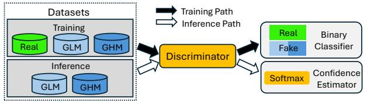

[图3](#figure-3)：判别器的训练和推理路径。“Real”指来自真实世界高质量数据集的图像。“Fake”指扩散模型生成的图像。GLM：轻量级扩散模型生成的图像；GHM：重量级扩散模型生成的图像。

该方法优于传统指标如 CLIP 或 PickScore，这些指标无法可靠地分类查询难度，从而实现更精确高效的查询路由 [[图3](#figure-3)]。  
- **通过 MILP 优化实现动态资源分配**：DIFFSERVE 将资源管理建模为混合整数线性规划问题，联合优化置信度阈值、批处理大小和模型部署位置。此方法使系统能够适应波动的查询需求，同时满足延迟服务水平目标（SLO）。

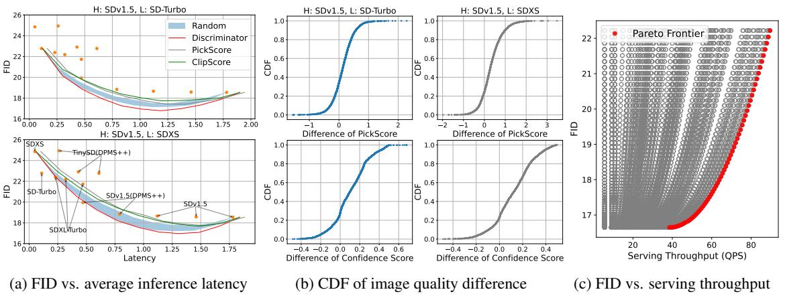

[图1](#figure-1)：(a) 独立扩散模型和不同判别器设计的扩散模型级联系统在批量大小为1时的质量-延迟权衡。上图使用 SDv1.5 作为重量级模型（H），SD-Turbo 作为轻量级模型（L）。下图则使用 SDXS 作为轻量级模型。通过使用更轻的模型或将更多查询视为简单查询，扩散模型级联实现了更低的延迟。FID 越低越好。(b) 轻量级模型与重量级模型生成图像质量差异的分布。x 轴负值表示轻量级模型生成的图像质量优于重量级模型。上图使用 PickScore 作为质量指标，下图使用本文提出的判别器置信度分数。(c) 不同资源分配配置对服务吞吐量（QPS）和响应质量（FID）的影响示意。所有结果均使用 MS-COCO 2017 数据集 [\(Lin et al.,](#page-12-0) [2014\)](#page-12-0)。

系统主动平衡不同模型变体间的工作负载，最大化硬件利用率并最小化延迟违规 [[图1](#figure-1)c]。  
- **集成的系统架构，包含控制路径和数据路径**：设计将查询路由和资源控制分离，负载均衡器首先将查询发送至轻量级模型和判别器，若置信度不足则条件性地转发至重量级模型。

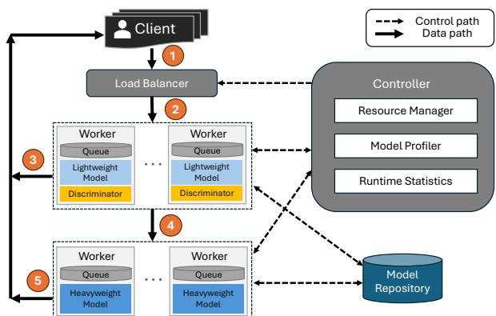

[图2](#figure-2)：DIFFSERVE 系统架构：(1) 客户端查询发送至负载均衡器，(2) 负载均衡器将查询发送至包含轻量级模型和判别器的工作节点，(3) 若置信度分数高于阈值，响应直接返回客户端，(4) 否则，查询转发至包含重量级模型的工作节点，(5) 其输出返回客户端。

控制器定期收集运行时统计数据，动态更新资源分配，确保对实时需求变化的响应能力并维持最佳性能 [[图2](#figure-2)]。

## 启示

- **采用基于查询感知的模型扩展以提升效率**：DIFFSERVE 的成功强调了根据查询复杂度定制模型选择的价值，使系统能够用轻量级模型处理简单查询而不损失质量。此方法显著提升了吞吐量和资源利用率，挑战了传统的一刀切服务范式。  
- **利用基于机器学习的判别器替代启发式指标**：传统质量指标如 CLIP 和 PickScore 在区分查询难度方面表现不足。训练判别器（如 EfficientNet）区分生成图像与真实图像，提供了更细致准确的质量评估，对于有效的级联和路由决策至关重要。  
- **通过 MILP 动态优化资源分配**：将资源管理建模为混合整数线性规划问题，使 DIFFSERVE 能够自适应平衡延迟、吞吐量和质量约束。此系统化优化优于启发式或静态配置，实现了对波动查询负载的实时适应并保持服务水平目标。  
- **设计可扩展且可扩展的 AI 服务架构**：DIFFSERVE 的架构和算法不仅适用于文本到图像扩散模型，还可推广至大型语言模型（LLMs）或多阶段流水线等其他领域。未来 AI 硬件公司应构建支持异构模型和多样化工作负载的灵活服务框架。

# FASTTREE: OPTIMIZING ATTENTION KERNEL AND RUNTIME FOR TREE-STRUCTURED LLM INFERENCE

- Zaifeng Pan 1, Yitong Ding 1, Yue Guan 1, Zheng Wang 1, Zhongkai Yu 1, Xulong Tang 2, Yida Wang 3, Yufei Ding 1
- University of California, San Diego 1, University of Pittsburgh 2, AWS 3

## 核心技术创新

- **基于内存布局引导的注意力核设计**：FastTree创新性地将GPU注意力核与基数树结构的KV缓存对齐，聚合共享上下文前缀的查询。这减少了冗余的全局内存加载，并将低效的矩阵-向量乘法转变为适合张量核心的矩阵-矩阵乘法，显著提升了GPU利用率和吞吐量。
- **通过二元边分配实现自适应上下文-查询分组**：系统将分组问题形式化为KV缓存树上的二元边分配问题，支持灵活地连接上下文节点。一个轻量级、考虑开销的贪心启发式算法在运行时高效探索庞大的决策空间，平衡填充开销、中间结果成本，并最大化查询聚合以优化核性能。
- **运行时长上下文拆分以缓解GPU利用率不足**：FastTree通过动态拆分过长的上下文，解决了因并行度不足或长尾上下文长度导致的GPU SM利用率低下问题。该策略提升了块级并行度和负载均衡，有效隐藏了中间结果归约的开销，增强了整体核效率。
- **针对工作负载异质性的多阶段分块**：鉴于查询在树各层分布不均，FastTree将基数树划分为多个阶段，采用不同的分块大小。靠近根部的大分块最大化KV重用以聚合查询，而靠近叶子的较小分块提升共享内存效率和SM占用率，在并行度与数据重用之间取得平衡。

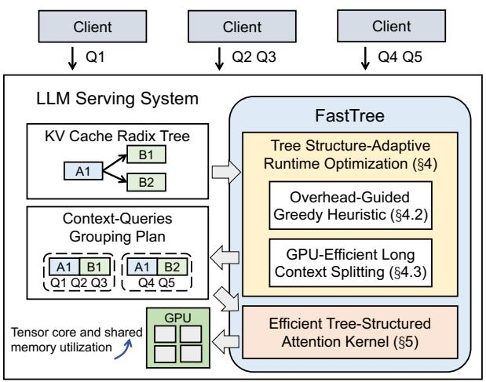

[图3]：FastTree概览。

这些创新使FastTree在多种LLM基准测试中，相较于最先进的注意力核实现，最高实现了10倍的加速，并带来了稳定的端到端吞吐量提升，如[图3]所示。

## 启示

- **自适应运行时优化是LLM服务的关键**：FastTree的成功表明，动态调整计算以适应不断变化的KV缓存树结构能够释放显著的效率提升。这提示未来的LLM服务系统应集成自适应启发式算法，实时平衡内存重用与并行度，而非依赖静态计算模式。
- **硬件感知的核设计推动性能提升**：通过将注意力核与GPU共享内存和张量核心能力对齐，FastTree展示了算法与硬件特性协同设计的重要性。AI硬件公司应优先考虑利用多级内存层次结构和支持灵活批处理的核架构，以最大化复杂推理工作负载的吞吐量。

# SELF-DATA DISTILLATION FOR RECOVERING QUALITY IN PRUNED LARGE LANGUAGE MODELS

- Vithursan Thangarasa 1, Ganesh Venkatesh 1, Mike Lasby 2, Nish Sinnadurai 1, Sean Lie 1
- Cerebras Systems 1, University of Calgary 2

## 核心技术创新

- **自我数据蒸馏微调以缓解剪枝损失**：核心创新在于使用原始未剪枝模型生成蒸馏数据集，该数据集保留了语义丰富性并与基础模型的知识高度一致。这种方法有效抵消了结构化剪枝后标准监督微调引起的灾难性遗忘和分布偏移，使剪枝后的大型语言模型（LLM）能够显著恢复更高质量的性能。  
- **基于角度余弦度量的高效层剪枝**：通过利用层输出之间的角度余弦相似度，该方法识别高度冗余的连续层进行移除，且对模型质量影响最小。该度量在计算效率和剪枝效果之间取得平衡，优于更复杂的替代方案，并且能够良好地扩展到大型模型。  
- **通过球面线性插值（SLERP）进行模型合并**：利用SLERP将多个在不同数据集上通过自我数据蒸馏微调的模型合并，综合互补知识，进一步提升剪枝后的泛化能力和鲁棒性。这种几何插值方法保持了参数空间的性质，较简单的数据集混合方法实现了更高的准确率恢复。  
- **与推理加速的推测解码集成**：将自我数据蒸馏剪枝模型扩展到推测解码，提高了令牌接受率并降低了延迟，通过更好地对齐草稿模型和目标模型。这种协同不仅在剪枝下保持了推理能力，还推动了大规模LLM的高效部署策略。

## 启示

- **聚焦分布对齐的策略**：通过自我数据蒸馏使微调数据与原始模型学习的分布对齐，有效缓解了剪枝大型语言模型时的灾难性遗忘问题。这一洞见鼓励AI硬件公司在模型压缩中结合以数据为中心的方法与架构优化，实现更稳健的模型压缩。  
- **压缩与加速的协同效应**：自我数据蒸馏剪枝与推测解码的兼容性展示了有前景的商业化路径。通过提升令牌接受率和降低推理延迟，该方法支持下一代产品在高准确率与高效部署之间取得平衡，满足市场对可扩展、低延迟AI解决方案的关键需求。

# AI METROPOLIS: SCALING LARGE LANGUAGE MODEL-BASED MULTI-AGENT SIMULATION WITH OUT-OF-ORDER EXECUTION

- Zhiqiang Xie 1, Hao Kang 2, Ying Sheng 1, Tushar Krishna 2, Kayvon Fatahalian 1, Christos Kozyrakis 1
- Stanford University 1, Georgia Institute of Technology 2

## 核心技术创新

- **用于仿真调度的乱序执行**：AI Metropolis打破了传统的逐步同步方式，使代理能够基于真实依赖关系异步前进。这种乱序执行消除了虚假的依赖关系，释放了显著更高的并行度和更好的硬件利用率，尤其在负载沉重的LLM推理任务中至关重要。
- **动态时空依赖追踪**：该引擎构建并维护一个专门的依赖图，编码了代理的时间步和空间邻近关系。

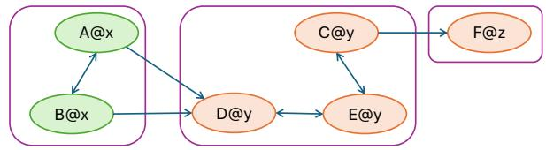

[图3](#figure-3)：时空依赖图示例。每个节点如A@x表示代理A在特定时间步x。单箭头表示依赖关系，双箭头表示代理间的耦合关系。紫色框表示代理簇，绿色节点表示可自由前进的代理，橙色节点表示被阻塞的代理。

通过分析代理的移动半径和最大速度，AI Metropolis精确识别哪些代理是真正依赖或耦合的，使得独立簇能够无需不必要等待而前进，如[图3](#figure-3)所示。
- **基于交互耦合的代理聚类**：AI Metropolis不进行全局同步，而是将时空耦合的代理分组为簇，共同推进。这种细粒度聚类减少了同步开销和虚假依赖，实现了可扩展的并行执行，同时保证仿真正确性。
- **与关键仿真路径对齐的优先级调度**：鉴于部分LLM调用位于限制整体完成时间的长关键路径上，AI Metropolis采用优先队列优先调度早期步骤任务。这种细致的优先级策略缓解了保守依赖规则带来的阻塞效应，进一步提升吞吐量，接近最优性能。
这些创新共同解决了LLM驱动的多代理仿真中推理延迟主导和负载不均的独特挑战。通过重新思考时间因果关系的强制执行并利用时空洞察，AI Metropolis在广泛基准测试中实现了最高4.15倍的加速，并能高效扩展至数千代理。

## 启示

- **重新思考仿真同步范式**：AI Metropolis挑战了多代理LLM仿真中全局逐步同步是正确性必要条件的根深蒂固假设。通过利用时空局部性和依赖追踪，揭示了许多强制依赖是虚假的，为更高效、可扩展的仿真设计开辟了新途径。
- **战略性优先级调度提升吞吐量**：基于仿真步骤的优先队列引入表明，智能排序LLM请求能显著减少阻塞并提升硬件利用率。这一洞察表明未来AI硬件系统应纳入感知任务关键性的细粒度调度，以最大化并行度。
- **广泛适用性超越当前领域**：核心原则——代理仅感知环境的有限部分——反映了机器人、游戏和社交网络仿真中的现实约束。这表明AI Metropolis的方法可推广至多样仿真场景，鼓励AI硬件公司设计适应各种时空依赖模型的灵活中间件。
- **平衡离线吞吐量与交互延迟**：虽然AI Metropolis目前面向优先考虑吞吐量的离线仿真，其依赖管理和调度技术对混合交互系统同样具有潜力。这预示着未来AI硬件解决方案必须动态平衡延迟敏感任务与大规模后台仿真，为下一代产品路线提供指导。

# RUBICK: EXPLOITING JOB RECONFIGURABILITY FOR DEEP LEARNING CLUSTER SCHEDULING

- Xinyi Zhang 1, Hanyu Zhao 2, Wencong Xiao 2, Xianyan Jia 2, Fei Xu 1, Yong Li 2, Wei Lin 2, Fangming Liu 3
- School of Computer Science and Technology, East China Normal University 1, Alibaba Group 2, Peng Cheng Laboratory, and Huazhong University of Science and Technology 3

## 核心技术创新

- **执行计划与资源的动态协同优化**：Rubick打破传统静态调度方式，实时联合调优深度学习作业的执行计划和多维资源分配（GPU、CPU、内存、带宽）。这种白盒方法支持持续重配置，以适应集群资源的波动，显著提升吞吐量并缩短作业完成时间。
- **针对多样训练策略的全面性能建模**：Rubick构建了细粒度且可拟合的性能模型，通过将迭代时间分解为重叠的组成部分（前向、后向、通信、优化、卸载），预测训练吞吐量。该模型捕捉执行计划（如3D并行、ZeRO变体、梯度检查点）与异构资源可用性之间的复杂交互，实现无需全面剖析的准确性能预测。
- **指导启发式调度的资源敏感度曲线**：Rubick预先计算资源敏感度曲线，映射不同执行计划下作业吞吐量与资源扩展的关系，快速识别哪些作业从额外资源中获益最大。该洞察驱动启发式调度策略，将资源从敏感度较低的作业重新分配给敏感度较高的作业，优化集群整体利用率并满足服务级别目标。
- **与现有训练框架的无缝集成及弹性重配置**：Rubick利用DeepSpeed和Megatron等流行框架的标准接口，透明地通过切换执行计划或调整并行度重配置作业，无需修改模型代码或影响收敛性。此设计确保在真实共享GPU集群中具备实用性和低开销。

## 启示

- **动态执行计划适配至关重要**：Rubick的成功强调了将执行计划重配置纳入集群调度的重要性。静态、用户选择的计划无法充分利用共享集群中波动的资源，而动态适配能够释放显著的性能和利用率提升。
- **多资源感知驱动下一代调度器**：Rubick的多维资源建模——涵盖GPU、CPU、内存和带宽——表明未来的AI硬件产品和调度系统必须超越以GPU为中心的视角。整体资源协调是优化异构环境中大模型训练负载的关键。

# RADIUS: RANGE-BASED GRADIENT SPARSITY FOR LARGE FOUNDATION MODEL PRE-TRAINING

- Mingkai Zheng 1, Zhao Zhang 1
- Department of Electrical and Computer Engineering, Rutgers University 1

## 核心技术创新

- **Top-k梯度的时间稳定性实现高效稀疏性**：Radius 利用一个关键洞察，即在训练的15-20%步骤之后，梯度中最大幅值的索引在时间上保持高度稳定。  

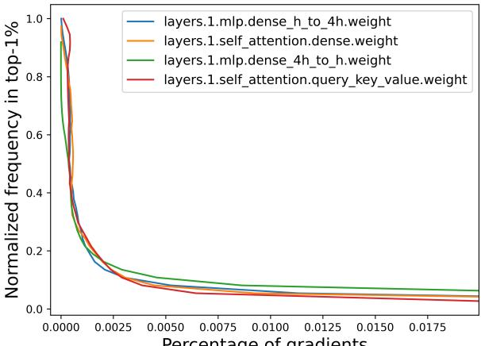

[图1](#figure-1)：GPT-355M预训练中，从第80,000步到第84,000步，梯度中幅值排名前1%的分布情况

这种时间局部性允许在多次迭代中重复使用top-k索引，极大地减少了频繁top-k选择的开销，并实现了结构化的稀疏梯度通信，无需每步交换索引，如[图1](#figure-1)所示。  
- **基于Allreduce的通信替代高成本的Allgather**：与传统依赖allgather的top-k稀疏方法不同，allgather的通信和内存开销随工作节点数线性增长，Radius采用allreduce聚合具有相同top-k索引的稀疏梯度。此架构转变突破了可扩展性瓶颈，通信量按压缩密度比例减少，实现了高效的大规模数据并行。  
- **与AdamW优化器对齐的梯度校正确保收敛性**：Radius在top-k选择前集成了一个梯度校正步骤，模拟AdamW的非线性更新规则。该调整解决了小梯度因优化器状态仍能引起显著参数更新的问题，确保稀疏化聚焦于最具影响力的梯度，保持收敛性和下游任务性能。  
- **误差反馈机制缓解近似误差**：为补偿稀疏化带来的信息损失，Radius将top-k集合外的残差梯度累积于缓冲区，并周期性地重新引入。该误差反馈防止了发散，保持了优化方向的准确性，在激进梯度压缩下有效平衡了加速与精度。

## 启示

- **利用梯度时间稳定性实现可扩展性**：Radius的关键洞察——top-k梯度索引在早期训练后趋于稳定——使得稀疏模式可复用，极大降低通信开销且不损失收敛性。该原则为未来AI与硬件协同设计提供了有前景的方向，以优化大规模分布式训练效率。  
- **压缩率与优化器动态的平衡**：梯度稀疏性与AdamW非线性更新的相互作用表明，中等稀疏率（约40%）实现了加速与精度保持的最佳平衡。这凸显了硬件感知算法调优的必要性，以在加速训练的同时维护优化器的准确性。

# KNOW WHERE YOU'RE UNCERTAIN WHEN PLANNING WITH MULTIMODAL FOUNDATION MODELS: A FORMAL FRAMEWORK

- Neel P. Bhatt 1, Yunhao Yang 1, Rohan Siva 1, Daniel Milan 1, Ufuk Topcu 1, Zhangyang Wang 1
- The University of Texas at Austin 1

## 核心技术创新

- **不确定性解耦框架**：核心创新在于明确区分感知不确定性——源自视觉解释错误——和决策不确定性——源自计划生成的鲁棒性。此解耦使得能够精确诊断并有针对性地缓解问题，克服了以往整体不确定性度量掩盖根本原因的局限性。
- **基于保形预测的感知校准**：利用保形预测理论，该框架将softmax置信度分数校准为统计有效的感知不确定性界限。这为物体识别准确性提供了理论基础的概率保证，增强了输入视觉信息对下游规划的可信度。
- **基于形式方法的决策不确定性预测（FMDP）**：引入形式验证的新颖应用，框架将文本计划转换为Kripke结构，并针对时序逻辑规范进行验证。该方法无需昂贵的人类标注即可量化决策不确定性，提供了计划符合任务要求的严格保证。
- **通过主动感知和自动精炼实现有针对性的干预**：基于不确定性量化，系统动态触发主动感知以重新观察高感知不确定性的场景，减少误差传播。同时，自动精炼过程利用不确定性评分筛选的高置信度数据对模型进行微调，显著提升计划的可靠性和规范遵循度。

图1：我们的规划框架解耦感知和决策不确定性，触发主动感知干预。该框架通过减少感知误差传播，提高生成计划的鲁棒性。

图2：我们的自动精炼框架生成高置信度训练数据，并微调基础模型以提升其生成符合任务要求计划的能力。

该闭环设计增强了真实和模拟自主任务中的鲁棒性和适应性（见图1和图2）。

## 启示

- **有针对性的不确定性管理提升可靠性**：解耦感知与决策不确定性使得能够实施精准干预，如主动感知和自动精炼，显著增强模型鲁棒性，降低现实机器人规划任务中的失败率。该方法超越了整体不确定性估计，提供了可扩展且可解释的可靠性提升方案。
- **形式验证集成是实现可扩展AI-硬件协同的关键**：利用形式方法量化决策不确定性，无需人工标签，为AI硬件公司将可验证的安全保障嵌入下一代自主系统开辟了路径。符号验证与多模态模型的融合，有望推动面向复杂安全关键环境的可信、可认证AI硬件解决方案的发展。

# MILO: EFFICIENT QUANTIZED MOE INFERENCE WITH MIXTURE OF LOW-RANK COMPENSATORS

- Beichen Huang 1 2, Yueming Yuan 1, Zelei Shao 1, Minjia Zhang 1
- SSAIL Lab, The Grainger College of Engineering, University of Illinois Urbana-Champaign 1, Work done while intern at UIUC 2

## 核心技术创新

- **极端量化的自适应低秩补偿器**：MiLo创新性地通过混合低秩补偿器增强高度量化的MoE权重（最低至3位），选择性地恢复在不重要权重值中丢失的信息。

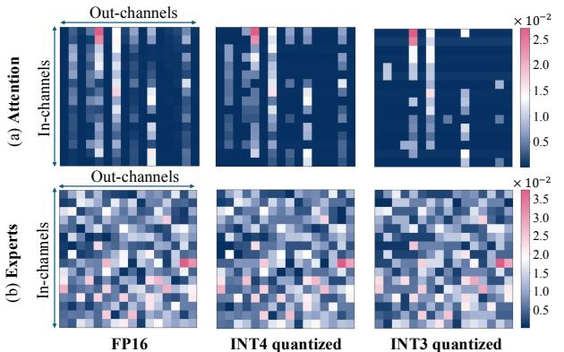

[图2](#figure-2)：Mixtral-8x7B中(a)来自*attention*投影的权重采样和(b)来自*expert*的权重采样。

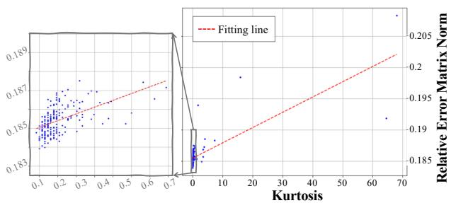

[图5](#figure-5)：相对Frobenius范数与峰度的相关性。每个点代表DeepSeek-MoE第一层的一个权重矩阵。

该自适应方法利用了稠密层和稀疏层的不同特性，以及专家激活频率和权重分布峰度，针对关键部分分配秩，有效平衡了准确率和内存开销（参见[图2](#figure-2)和[图5](#figure-5)）。
- **无校准的迭代优化算法**：不同于依赖校准数据、存在过拟合风险且计算成本高的先前方法，MiLo采用无训练的迭代优化，联合细化量化权重和补偿器。

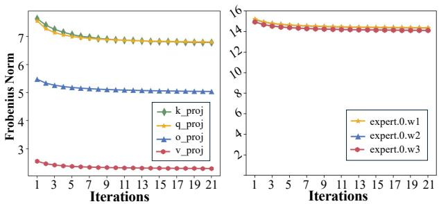

[图7](#figure-7)：专家矩阵（左）和注意力矩阵（右）的收敛曲线。

该方法将问题分解为量化误差最小化和低秩残差逼近的交替子问题，高效收敛以最小化准确率损失且无外部数据偏差（[图7](#figure-7)展示了收敛过程）。
- **硬件友好的INT3量化内核设计**：MiLo开创了零位浪费的3位权重打包方案，以及利用二进制操作和寄存器级并行实现的高效INT3到FP16反量化。

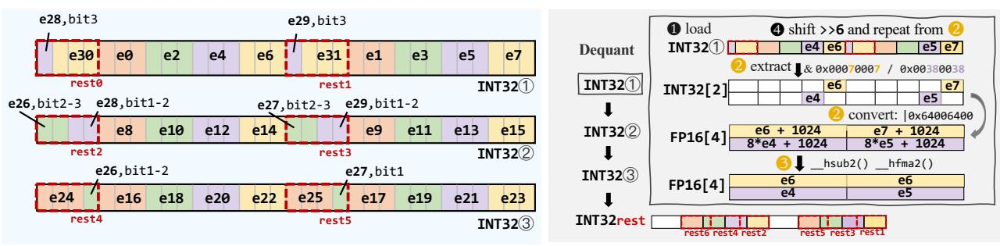

[图6](#figure-6)：图(a)展示了零位浪费的3位权重打包，图(b)展示了反量化过程。详细演示了INT32(1)的反量化。

结合异步全局权重加载和MoE特定的tile形状调优，该内核在NVIDIA Ampere GPU上实现了真实延迟加速（相较INT4 MARLIN后端最高达1.26×），支持批量大小大于1，促进了极端量化MoE的实际部署（参见[图6](#figure-6)）。
- **系统级与算法协同优化**：自适应低秩补偿、无校准优化和内核实现的结合，使MiLo能够在几乎无准确率损失的情况下压缩最先进的MoE模型，同时减少内存占用和推理延迟。该集成方法在性能和效率上均超越现有量化方法，展示了在有限硬件资源上部署大规模MoE的可扩展路径。

## 启示

- **无校准量化解锁可扩展MoE部署**：MiLo避免使用校准数据，消除了过拟合风险并缩短量化时间，解决了在有限内存GPU上部署大规模MoE模型的关键瓶颈，为无需昂贵再训练或校准开销的大规模LLM推理铺平道路。
- **自适应低秩补偿器实现精度与内存的权衡**：通过基于层结构和数据分布（如峰度、专家激活频率）调整补偿器秩，MiLo高效恢复极端量化中丢失的准确率，且内存开销极小。此见解鼓励未来AI硬件设计采用灵活、数据感知的压缩方案，而非统一量化。
- **硬件感知的INT3内核设计是实现真实延迟提升的关键**：MiLo的零位浪费3位权重打包和异步内存加载充分利用GPU架构特性，将理论压缩转化为实际加速，尤其在批量大小大于1时表现突出。这凸显了量化算法与硬件友好内核协同设计对下一代AI加速器的重要性。
- **MiLo的模块化方法指示新的商业化路径**：将量化、低秩补偿和内核优化作为独立但联合优化的组件，提供了一个灵活框架，适应不断演进的MoE架构和硬件平台。该模块化支持渐进式产品改进和更易集成到现有AI推理堆栈。
